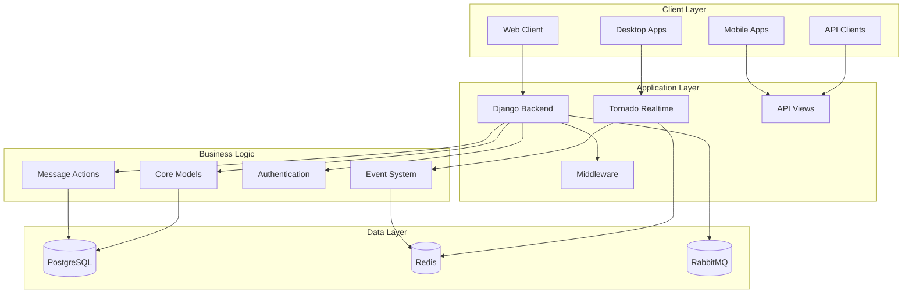

# Zulip Repository Overview

## Purpose

The `zulip--zulip` repository contains the complete source code for Zulip, an open-source team chat application designed for real-time collaboration. Zulip combines the immediacy of real-time chat with the organization of threaded conversations, making it ideal for distributed teams and communities.

## Architecture Overview

Zulip follows a modern web application architecture with Django as the backend framework, PostgreSQL for data persistence, Redis for caching and real-time messaging, and Tornado for WebSocket connections. The system is designed to scale from small teams to large enterprises with support for multi-tenancy, extensive integrations, and robust security features.

## Core Modules

### 1. Core Models (`core_models`)
The foundational data layer defining all business entities including realms (organizations), users, messages, streams (channels), and permissions. Implements multi-tenant architecture with complete data isolation between organizations.

**Key Components:**
- Realms & Organizations management
- Users & Authentication profiles
- Messages & Communication system
- Streams & Channels with permissions
- Recipients & Routing for message delivery
- Groups & Permissions for access control

### 2. Authentication and Backends (`authentication_and_backends`)
Comprehensive authentication system supporting multiple methods including email/password, LDAP, SAML, OAuth2 (Google, GitHub, GitLab, Apple, Azure AD), and JWT tokens. Includes rate limiting, session management, and enterprise integration features.

### 3. Message Actions (`message_actions`)
Central hub for message lifecycle management handling message creation, editing, deletion, and user group operations. Coordinates with the event system for real-time notifications and ensures proper permission validation.

### 4. Event System (`event_system`)
Real-time event distribution framework that synchronizes all clients with server state changes. Handles message events, user updates, realm configuration changes, and typing notifications through a structured event protocol.

### 5. Tornado Realtime (`tornado_realtime`)
WebSocket-based real-time delivery system built on Tornado framework. Manages long-polling connections, event queues, and client connection lifecycle with support for horizontal scaling.

### 6. API Views (`api_views`)
REST API interface layer providing endpoints for all system functionalities including stream management, user operations, and authentication flows. Implements comprehensive security measures and input validation.

### 7. Core Libraries (`core_libraries`)
Shared utilities and data processing layer providing caching mechanisms, type definitions, and helper functions for message handling, user management, stream operations, and data validation.

### 8. Middleware (`middleware`)
Request/response processing pipeline handling cross-cutting concerns including rate limiting, internationalization, domain validation, error handling, logging, and security features.

### 9. Management Commands (`management_commands`)
Administrative command-line tools for system operations including realm and user creation, data export/import, and queue processing management.

### 10. Worker Queue System (`worker_queue_system`)
Asynchronous task processing framework using RabbitMQ for background operations including email notifications, push notifications, and webhook integrations.

### 11. Corporate Billing (`corporate_billing`)
Comprehensive billing and subscription management system with Stripe integration supporting both cloud and self-hosted deployments with flexible licensing models.

### 12. Analytics (`analytics`)
Hierarchical data collection system tracking usage metrics at user, stream, realm, and installation levels for reporting and optimization.

### 13. Confirmation System (`confirmation_system`)
Secure token-based confirmation system for user actions including registration, email changes, invitations, and realm operations with configurable expiration and security features.

### 14. Remote Server Management (`remote_server_management`)
Infrastructure for managing self-hosted Zulip servers including push notification forwarding, billing coordination, and audit log synchronization.

## Key Features

- **Real-time Messaging**: Instant message delivery with threading and topic organization
- **Multi-tenancy**: Complete isolation between organizations with shared infrastructure
- **Extensive Integrations**: Support for GitHub, GitLab, Jira, and hundreds of other services
- **Enterprise Security**: LDAP/SAML authentication, 2FA, granular permissions, and audit logging
- **Mobile & Desktop**: Native applications for all major platforms
- **Scalability**: Designed to handle millions of messages and thousands of concurrent users
- **Open Source**: Fully open-source with active community development

## Technology Stack

- **Backend**: Python, Django, Tornado
- **Database**: PostgreSQL with advanced indexing and constraints
- **Cache**: Redis for sessions, real-time data, and caching
- **Queue**: RabbitMQ for asynchronous task processing
- **Frontend**: JavaScript, TypeScript, React
- **Mobile**: React Native for iOS and Android
- **Infrastructure**: Docker, Kubernetes support

This repository represents a production-ready, enterprise-grade team collaboration platform with comprehensive features for real-time communication, extensive customization options, and robust security measures suitable for organizations of any size.