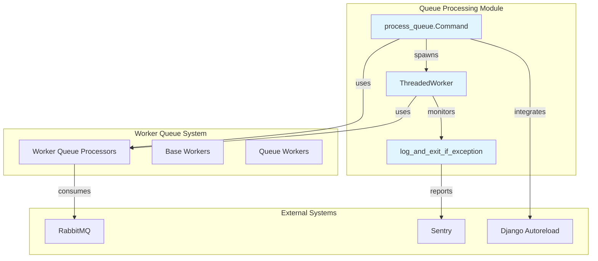
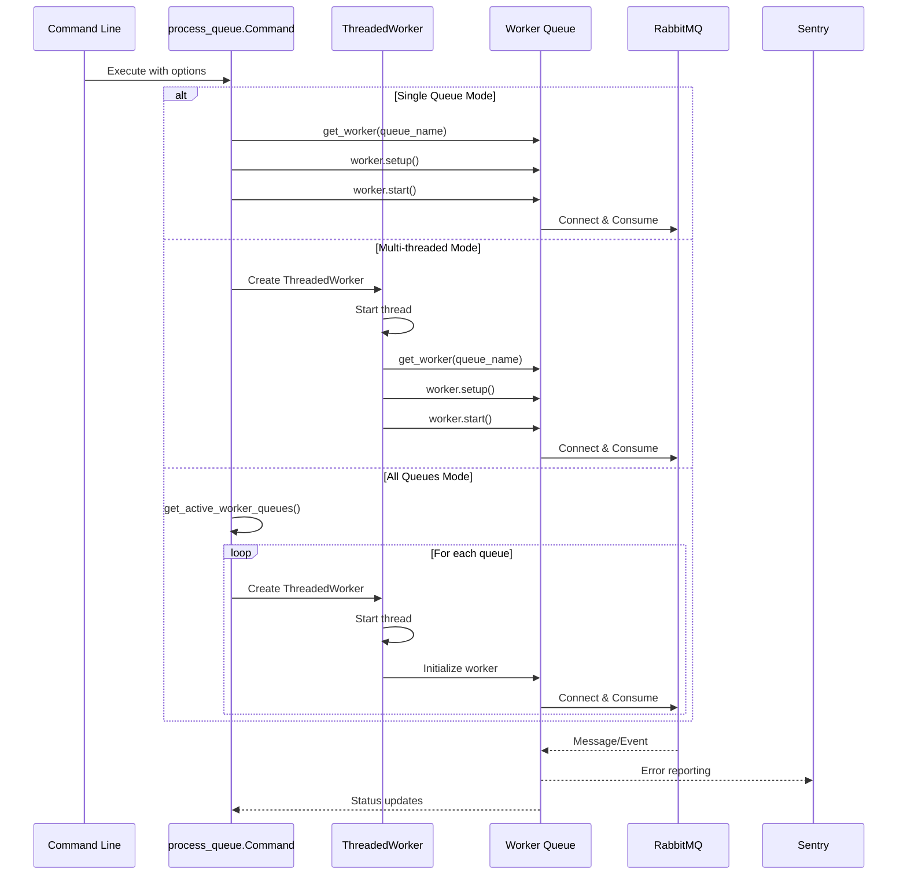
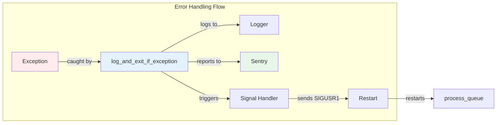

# Queue Processing Module Documentation

## Introduction

The queue processing module is a critical component of the Zulip messaging system that manages asynchronous task execution through a distributed queue architecture. Built on top of RabbitMQ, this module provides reliable, scalable background processing for various system operations including email notifications, push notifications, webhook deliveries, and other time-intensive tasks that shouldn't block the main application flow.

The module serves as the command-line interface for starting and managing queue workers, supporting both single-threaded and multi-threaded execution modes. It integrates with Django's autoreload system for development environments and includes comprehensive error handling and monitoring capabilities through Sentry integration.

## Architecture Overview



## Core Components

### process_queue.Command

The main command-line interface for managing queue workers. This Django management command provides flexible options for running queue processors in different configurations:

- **Single Queue Mode**: Processes one specific queue with optional worker numbering
- **Multi-threaded Mode**: Launches multiple queue workers in separate threads
- **All Queues Mode**: Automatically discovers and processes all active queues

Key features include:
- Signal handling for graceful shutdown (SIGTERM, SIGINT, SIGUSR1)
- Integration with Django's autoreload system for development
- Sentry error monitoring and reporting
- Comprehensive logging with structured context

### ThreadedWorker

A threading wrapper that enables concurrent processing of multiple queues within a single process. Each ThreadedWorker instance:
- Runs in its own thread with isolated Sentry context
- Uses the log_and_exit_if_exception context manager for error handling
- Automatically restarts on unhandled exceptions via SIGUSR1 signaling
- Supports the same worker lifecycle as single-threaded mode

### log_and_exit_if_exception

A context manager that provides consistent error handling across all queue processing modes:
- Logs unhandled exceptions with full stack traces
- Triggers appropriate shutdown behavior based on threading context
- Ensures worker processes restart automatically after critical failures
- Maintains Sentry integration for error tracking

## Data Flow Architecture



## Queue Worker Integration

The queue processing module integrates with the [worker_queue_system](worker_queue_system.md) to provide the actual message processing capabilities. The integration follows a plugin architecture where:

1. **Worker Discovery**: The `get_active_worker_queues()` function dynamically discovers available worker modules
2. **Worker Instantiation**: The `get_worker()` function creates appropriate worker instances based on queue names
3. **Lifecycle Management**: Workers follow a standard setup/start/stop lifecycle managed by the command
4. **Error Propagation**: Worker exceptions are caught and handled by the module's error handling system

## Configuration and Deployment

### Environment Requirements

- **RabbitMQ**: Must be configured and running (`USING_RABBITMQ=True`)
- **Sentry**: Optional but recommended for production error tracking
- **Django Settings**: Proper queue configuration and worker settings

### Command Options

```bash
# Single queue processing
python manage.py process_queue --queue_name <queue_name> [--worker_num <num>]

# Multi-threaded processing
python manage.py process_queue --multi_threaded <queue1> <queue2> ...

# Process all active queues
python manage.py process_queue --all
```

### Signal Handling

The module implements sophisticated signal handling for different operational contexts:

- **SIGTERM/SIGINT**: Graceful shutdown with worker cleanup
- **SIGUSR1**: Special restart signal that triggers Django autoreload (exit code 3)
- **Threaded Mode**: SIGUSR1 triggers process restart on unhandled exceptions

## Error Handling and Monitoring



The module provides comprehensive error handling through:

1. **Exception Logging**: All unhandled exceptions are logged with full context
2. **Sentry Integration**: Automatic error reporting with queue and worker context
3. **Automatic Recovery**: Failed workers automatically restart via signal handling
4. **Graceful Degradation**: Individual worker failures don't affect other workers

## Integration with System Components

### Core Models Integration
The queue processing module works with data from [core_models](core_models.md) including:
- **Messages**: Processing message-related events and notifications
- **Users**: Handling user activity notifications and email digests
- **Realms**: Managing realm-specific queue operations
- **Streams**: Processing stream subscription and notification events

### Event System Integration
Queue workers process events from the [event_system](event_system.md) including:
- Message events (send, edit, delete, reactions)
- Subscription events (add, remove)
- User group events
- Realm configuration updates

### Authentication Integration
Some queue workers handle authentication-related tasks from [authentication_and_backends](authentication_and_backends.md) such as:
- Email verification messages
- Password reset notifications
- Two-factor authentication codes

## Performance and Scalability

### Threading Model
- Single-threaded mode for dedicated queue processing
- Multi-threaded mode for concurrent queue processing
- Thread-safe worker initialization and cleanup
- Isolated error contexts per thread

### Resource Management
- Automatic connection pooling to RabbitMQ
- Configurable prefetch limits for message batching
- Memory-efficient message processing
- Graceful shutdown with resource cleanup

### Monitoring and Observability
- Structured logging with queue and worker context
- Sentry integration for error tracking
- Performance metrics through worker statistics
- Health check capabilities via signal handling

## Development and Testing

### Development Mode Features
- Django autoreload integration for code changes
- Verbose logging for debugging
- Test queue support for development
- Graceful handling of missing RabbitMQ in test environments

### Testing Considerations
- Test suite bypasses RabbitMQ requirements
- Dedicated test queues for unit testing
- Mock worker implementations available
- Signal handling verification in test scenarios

This module serves as the backbone of Zulip's asynchronous processing infrastructure, ensuring reliable message delivery, notification handling, and background task execution across the entire system.