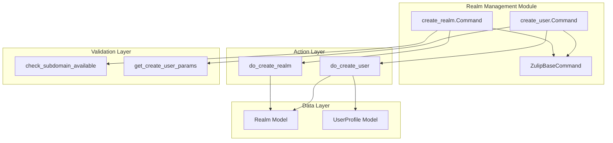
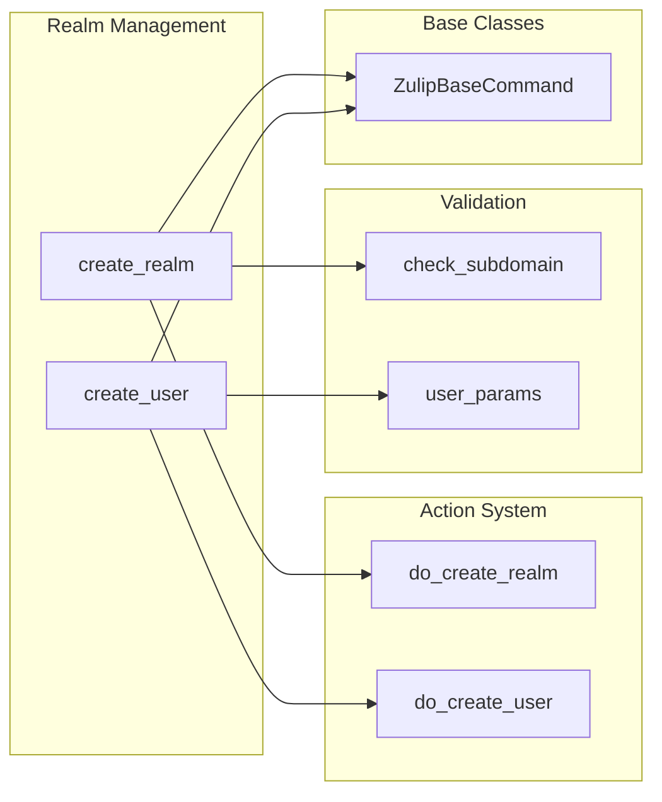
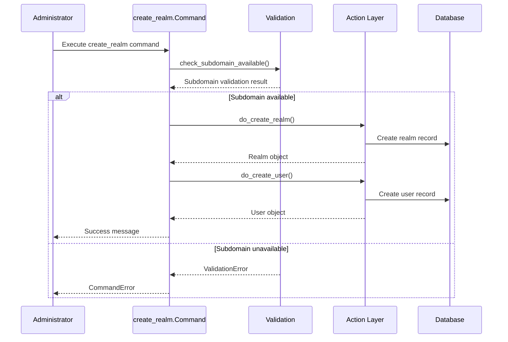
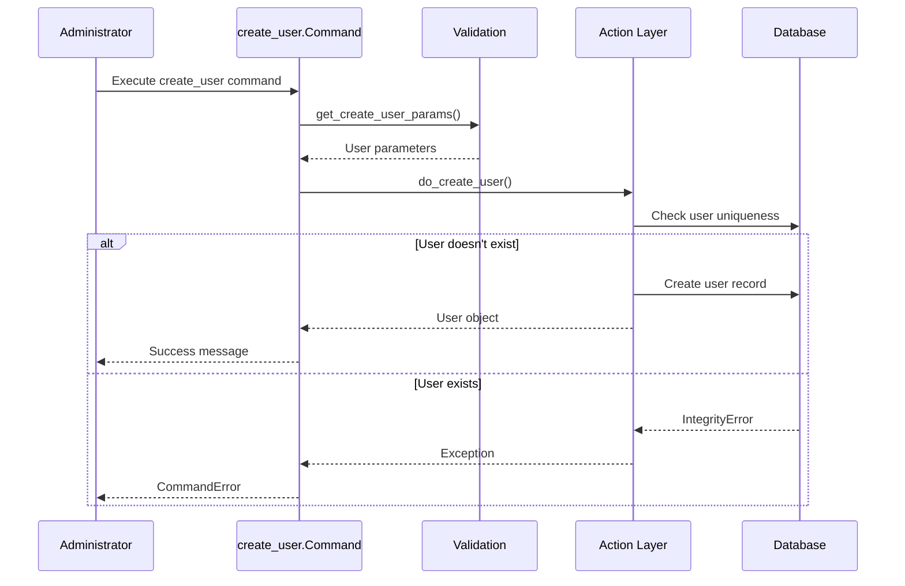

# Realm Management Module

The realm_management module provides command-line tools for creating and managing Zulip organizations (realms) and users. This module is part of the management_commands system and offers administrative capabilities for server setup and user provisioning.

## Overview

The realm_management module contains Django management commands that enable administrators to:
- Create new Zulip organizations (realms) from the command line
- Add users to existing realms
- Script the initial setup of Zulip servers
- Manage realm creation workflows in automated environments

## Core Components

### Command Classes

#### `zerver.management.commands.create_realm.Command`
A Django management command that creates a new Zulip organization (realm) with an initial owner user. This command combines realm creation with user creation since every realm must have at least one owner.

**Key Features:**
- Validates subdomain availability before creation
- Supports reserved subdomain usage with explicit flags
- Creates the initial realm owner user automatically
- Sets appropriate Terms of Service version for new users
- Integrates with the realm creation workflow system

#### `zerver.management.commands.create_user.Command`
A Django management command that creates new users in existing realms. This command provides a command-line interface for user provisioning.

**Key Features:**
- Validates user uniqueness within the target realm
- Supports interactive and scripted user creation
- Sets appropriate Terms of Service version for new users
- Integrates with the user creation action system

## Architecture



## Dependencies

### Internal Dependencies

The realm_management module depends on several core Zulip systems:

- **[core_models](core_models.md)**: Uses Realm and UserProfile models for data persistence
- **[message_actions](message_actions.md)**: Leverages user creation actions for consistency
- **[authentication_and_backends](authentication_and_backends.md)**: Integrates with authentication workflows

### Key Dependencies



## Data Flow

### Realm Creation Flow



### User Creation Flow



## Integration Points

### Management Command Framework

The realm_management module integrates with Django's management command framework through `ZulipBaseCommand`, which provides:

- Standardized argument parsing
- Realm resolution capabilities
- User parameter validation
- Consistent error handling

### Action System Integration

Both commands delegate the actual creation logic to the action system:

- `do_create_realm()`: Handles realm creation, validation, and initial setup
- `do_create_user()`: Manages user creation, role assignment, and profile setup

This separation ensures consistency between management commands and API-based creation workflows.

## Usage Patterns

### Interactive Usage

```bash
# Create a new realm interactively
./manage.py create_realm "My Organization" --string-id myorg

# Create a user interactively
./manage.py create_user --realm myorg
```

### Scripted Usage

```bash
# Create realm with full parameters
./manage.py create_realm "My Organization" \
    --string-id myorg \
    --email admin@example.com \
    --full-name "Admin User" \
    --password secure123

# Create user with all parameters
./manage.py create_user \
    --realm myorg \
    --email user@example.com \
    --full-name "John Doe" \
    --password userpass123
```

## Error Handling

The module implements comprehensive error handling:

- **ValidationError**: Subdomain availability issues
- **CommandError**: General command execution failures
- **IntegrityError**: User uniqueness violations
- **AssertionError**: Realm creation assertion failures

## Security Considerations

### Access Control

- Management commands require server-level access
- No web-based interface to prevent unauthorized access
- Command execution logged for audit purposes

### Data Validation

- Subdomain validation prevents reserved name usage
- Email format validation ensures data integrity
- Password requirements enforced through parameter validation

## Best Practices

### Recommended Usage

1. **Use Web Interface**: For most use cases, the web-based realm creation link is recommended
2. **Scripting**: Use management commands for automated deployments
3. **Validation**: Always validate inputs before command execution
4. **Error Handling**: Implement proper error handling in scripts

### Alternatives

- **Web Interface**: `generate_realm_creation_link` for user-friendly creation
- **API**: Zulip API for programmatic user creation
- **Import/Export**: For bulk operations, consider [data_operations](data_operations.md)

## Related Modules

- **[data_operations](data_operations.md)**: For bulk import/export operations
- **[authentication_and_backends](authentication_and_backends.md)**: For authentication configuration
- **[core_models](core_models.md)**: For data model definitions
- **[management_commands](management_commands.md)**: For other administrative commands

## Future Considerations

The realm_management module may be extended to support:

- Bulk user creation operations
- Realm template configurations
- Advanced validation rules
- Integration with external identity providers
- Automated realm configuration workflows