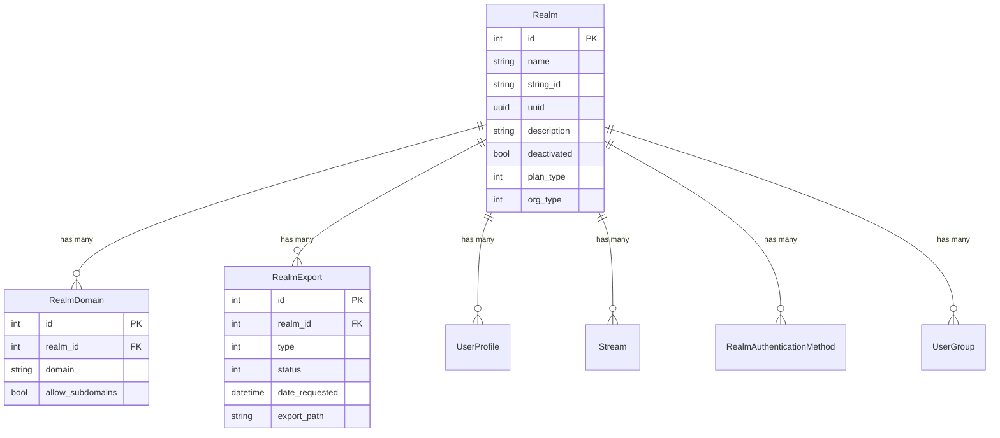
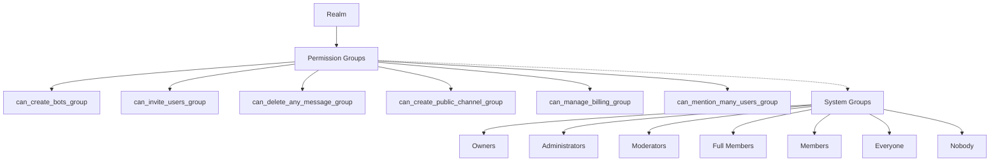
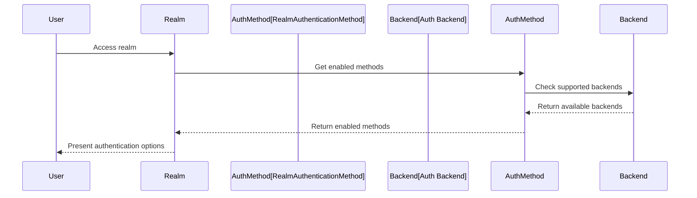
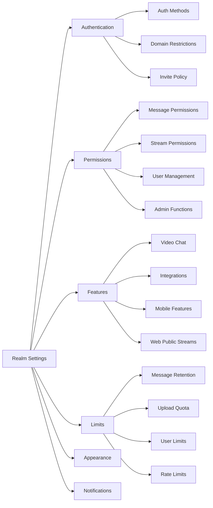
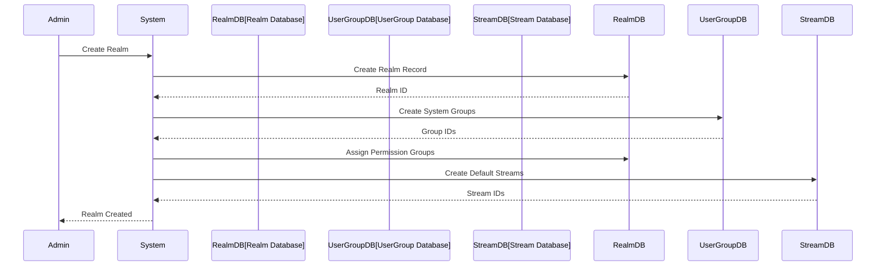
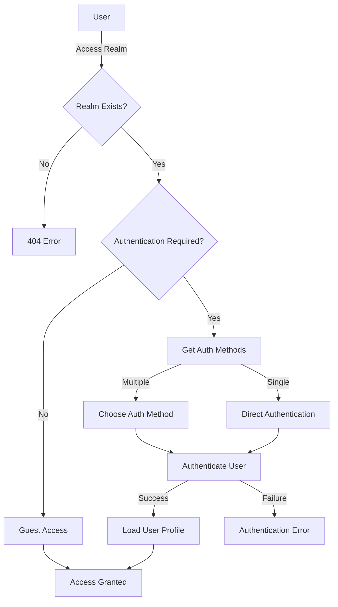

# Realms Module Documentation

## Introduction

The realms module is the foundational component of Zulip's multi-tenant architecture, managing organizations (called "realms") within a Zulip server. Each realm represents an isolated organization with its own users, streams, messages, and configuration settings. This module provides the core data models and functionality for realm management, authentication, permissions, and organization-level settings.

## Core Components

### Realm Model
The central `Realm` model represents an organization within Zulip, containing comprehensive configuration for:
- **Identity**: Name, description, subdomain, and unique identifiers
- **Authentication**: Supported authentication methods and domain restrictions
- **Permissions**: Granular permission groups for various actions
- **Features**: Message editing, video chat, notifications, and content policies
- **Limits**: Message retention, upload quotas, and user limits
- **Organization Type**: Business, education, open-source, etc.

### RealmDomain Model
Manages allowed email domains for organizations that restrict membership to specific domains, supporting subdomain allowances.

### RealmExport Model
Tracks data export operations with different export types (public, full with/without consent) and status tracking.

## Architecture

### Data Model Relationships

### Permission System Architecture

### Authentication Integration

## Key Features

### Multi-Tenant Architecture
- **Isolated Organizations**: Each realm operates independently with complete data isolation
- **Subdomain Support**: Realms are accessed via subdomains (e.g., `company.zulipchat.com`)
- **Custom Branding**: Per-realm icons, logos, and welcome messages
- **Domain Restrictions**: Optional email domain restrictions for membership

### Granular Permission System
The module implements a sophisticated permission system using UserGroup assignments:

- **25+ Permission Categories**: From basic actions like inviting users to advanced features like managing billing
- **System Groups Integration**: Leverages the system groups module for role-based permissions
- **Flexible Configuration**: Each permission can be assigned to any user group
- **Default Security**: Conservative defaults with administrators having most permissions

### Organization Types and Plans
Supports various organization types with tailored features:
- **Business**: Standard commercial organizations
- **Education**: Academic institutions with special considerations
- **Open Source**: Free for open-source projects
- **Non-profit**: Discounted pricing for non-profits
- **Government**: Public sector organizations

### Message and Content Policies
Comprehensive content management:
- **Message Retention**: Configurable retention policies with automatic cleanup
- **Edit History**: Control over message edit history visibility
- **Content Moderation**: Wildcard mention controls and message deletion policies
- **Topic Management**: Empty topic policies and topic resolution permissions

## Integration Points

### Authentication and Backends
Integrates with the [authentication_and_backends](authentication_and_backends.md) module to support multiple authentication methods:
- Email/password authentication
- LDAP integration
- SAML SSO
- Social authentication (Google, GitHub, GitLab, etc.)
- Custom authentication backends

### User Management
Works closely with the [core_models](core_models.md) module's UserProfile model:
- User creation and management within realms
- Role assignments (owner, admin, moderator, member, guest)
- User deactivation and reactivation
- Cross-realm user access controls

### Stream and Message System
Integrates with message and stream modules:
- Stream creation permissions
- Message visibility controls
- Web-public stream access
- Message retention and archiving

### Analytics and Billing
Connects to [corporate_billing](corporate_billing.md) and [analytics](analytics.md) modules:
- Usage tracking and reporting
- Plan limitations and quotas
- Billing management permissions
- Resource usage monitoring

## Configuration Management

### Realm Settings Categories

### Dynamic Configuration
The module supports runtime configuration changes:
- **Hot Reloading**: Most settings take effect immediately
- **Cache Management**: Intelligent cache invalidation on configuration changes
- **Event Propagation**: Configuration changes are broadcast to connected clients
- **Validation**: Comprehensive validation for all configuration options

## Security Features

### Access Control
- **Domain Restrictions**: Email domain validation for organization membership
- **Invitation System**: Controlled user onboarding with invitation limits
- **Role-Based Permissions**: Hierarchical permission system
- **Guest Access**: Special guest user type with limited permissions

### Content Security
- **Message Retention**: Automatic message cleanup based on policies
- **Content Filtering**: GIPHY rating controls and content policies
- **Web Public Streams**: Controlled public access to selected streams
- **Export Controls**: Secure data export with audit trails

### Authentication Security
- **Multi-Factor Authentication**: Support for 2FA
- **Session Management**: Secure session handling
- **Rate Limiting**: Protection against brute force attacks
- **Audit Logging**: Comprehensive audit trails for security events

## Performance Considerations

### Caching Strategy
- **Realm Cache**: Aggressive caching of realm configuration
- **Permission Cache**: Cached permission calculations
- **Upload Space Cache**: Cached upload quota usage
- **Cache Invalidation**: Smart cache invalidation on changes

### Database Optimization
- **Indexed Fields**: Strategic indexing for common queries
- **Query Optimization**: Optimized queries for realm operations
- **Bulk Operations**: Efficient bulk operations for large datasets
- **Connection Pooling**: Database connection management

## Data Flow

### Realm Creation Process

### Authentication Flow

## Error Handling

### Validation Errors
- **Domain Validation**: Email domain validation with detailed error messages
- **Configuration Validation**: Comprehensive validation for all settings
- **Permission Validation**: Permission assignment validation
- **Quota Validation**: Upload and usage quota validation

### Exception Types
- `DomainNotAllowedForRealmError`: Domain restriction violations
- `DisposableEmailError`: Disposable email detection
- `EmailContainsPlusError`: Email format validation
- `InvalidFakeEmailDomainError`: Fake email domain issues
- `JsonableError`: General API error handling

## Testing and Development

### Test Utilities
- **Realm Creation**: Utilities for creating test realms
- **Permission Testing**: Helpers for testing permission scenarios
- **Configuration Testing**: Tools for testing configuration changes
- **Mock Data**: Sample data for development and testing

### Development Features
- **Debug Mode**: Enhanced logging and debugging capabilities
- **Test Configuration**: Special settings for testing environments
- **Cache Control**: Cache management for development
- **Hot Reloading**: Configuration changes without restart

## Deployment Considerations

### Multi-Server Deployment
- **Shared Database**: Realm data shared across application servers
- **Cache Consistency**: Cache synchronization across servers
- **Load Balancing**: Realm-aware load balancing
- **Failover**: Realm availability during server failures

### Scaling Considerations
- **Horizontal Scaling**: Realm data partitioning strategies
- **Vertical Scaling**: Resource allocation per realm
- **Geographic Distribution**: Realm placement strategies
- **Performance Monitoring**: Realm-specific performance metrics

## API Integration

### REST API Endpoints
The realms module provides comprehensive API endpoints for:
- Realm creation and management
- Configuration updates
- User and permission management
- Export operations
- Analytics and reporting

### WebSocket Events
Real-time updates for:
- Configuration changes
- Permission updates
- User status changes
- Realm-wide notifications

### Integration Hooks
- **External Authentication**: Integration with external auth systems
- **Directory Services**: LDAP/Active Directory integration
- **Analytics Platforms**: Usage and analytics data export
- **Monitoring Systems**: Health and performance monitoring

This comprehensive documentation covers the realms module's architecture, features, and integration points within the Zulip ecosystem. The module serves as the foundation for Zulip's multi-tenant architecture, providing robust organization management with extensive customization options and security features.