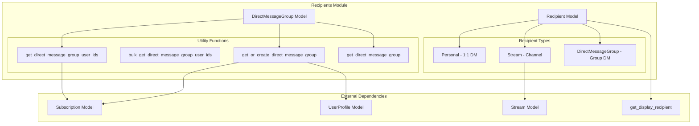
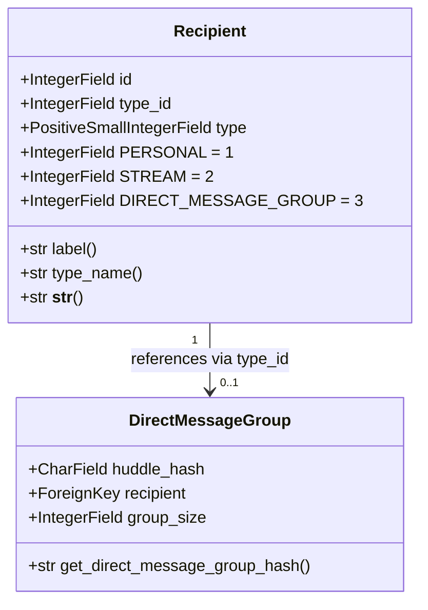
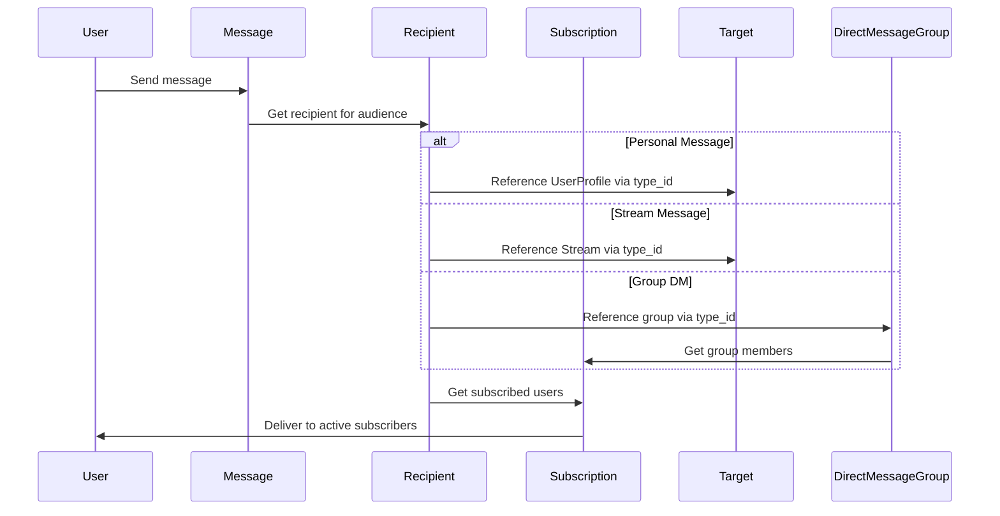
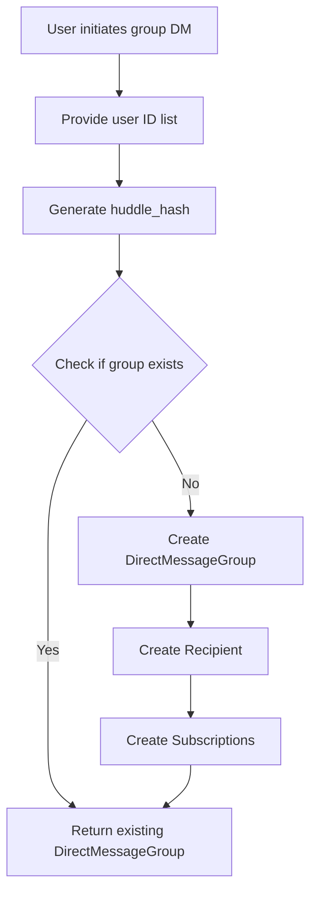
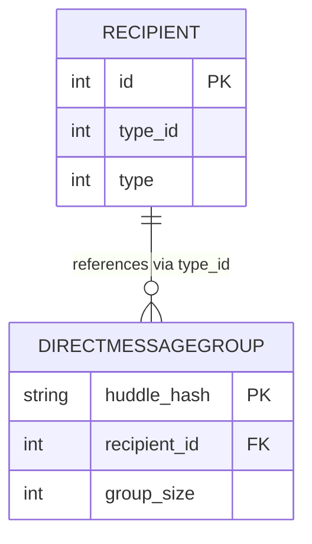

# Recipients Module Documentation

## Introduction

The recipients module is a core component of Zulip's messaging system that manages message delivery audiences. It provides the abstraction layer for determining who receives messages across different conversation types: direct messages, stream messages, and group direct messages. The module serves as the central hub for message routing and audience management within the Zulip platform.

## Architecture Overview

The recipients module implements a polymorphic design pattern where a single `Recipient` model can represent different types of message audiences. This design enables efficient message delivery while maintaining flexibility for various conversation types.



## Core Components

### Recipient Model

The `Recipient` model is the central abstraction that represents any audience that can receive messages in Zulip. It uses a type-type_id pattern to implement polymorphic behavior:

- **type**: An integer field representing the recipient type (Personal, Stream, or DirectMessageGroup)
- **type_id**: The ID of the associated object (UserProfile, Stream, or DirectMessageGroup)
- **Unique constraint**: Combination of (type, type_id) ensures no duplicate recipients



### DirectMessageGroup Model

The `DirectMessageGroup` model represents group direct message conversations. It uses a hash-based approach for efficient group lookup:

- **huddle_hash**: SHA1 hash of sorted user IDs for quick group identification
- **recipient**: Foreign key to the associated Recipient object
- **group_size**: Number of users in the group

## Data Flow

### Message Delivery Flow



### Group Direct Message Creation



## Key Functions

### get_direct_message_group_user_ids(recipient)
Retrieves user IDs for a group direct message recipient by querying the Subscription table.

### bulk_get_direct_message_group_user_ids(recipient_ids)
Efficiently retrieves user IDs for multiple group direct message recipients in a single database query.

### get_or_create_direct_message_group(id_list)
Creates or retrieves a DirectMessageGroup for the given list of user IDs, ensuring atomic creation of all related objects.

### get_direct_message_group(id_list)
Retrieves an existing DirectMessageGroup for the given user IDs, returning None if not found.

## Integration with Other Modules

### Message Module Integration
The recipients module is tightly integrated with the [messages module](messages.md). Every message has a recipient that determines its audience:

- [ArchivedMessage](messages.md#archivedmessage) references Recipient for message delivery
- [ArchivedUserMessage](messages.md#archivedusermessage) links users to messages through recipients
- Message routing depends on recipient type for delivery logic

### Stream Module Integration
Stream messages use the recipients module to represent channel audiences:
- [Stream](streams.md#stream-model) objects are referenced by Recipient via type_id
- Stream subscriptions are managed through the Subscription model
- Channel email addresses ([ChannelEmailAddress](streams.md#channelemailaddress)) integrate with recipient routing

### User Module Integration
User-related functionality connects through personal and group direct messages:
- [UserProfile](users.md#userprofile) objects are referenced for 1:1 direct messages
- User activity status affects message delivery through Subscription queries
- External authentication ([ExternalAuthID](users.md#externalauthid)) doesn't directly impact recipients but is part of user identity

### Subscription System
The Subscription model (not shown in core components but referenced) is crucial for:
- Storing user membership in streams and group direct messages
- Determining message delivery recipients
- Managing user notification preferences

## Database Schema



## Performance Considerations

1. **Hash-based Group Lookup**: DirectMessageGroup uses SHA1 hashing for O(1) group identification
2. **Bulk Operations**: Functions like `bulk_get_direct_message_group_user_ids` minimize database queries
3. **Database Indexes**: Both type and type_id are indexed for efficient recipient lookups
4. **Atomic Transactions**: Group creation uses atomic transactions to ensure data consistency

## Security and Privacy

- Recipient objects are created automatically and don't expose sensitive information directly
- Group membership is controlled through the Subscription model
- User visibility is managed through subscription-based access control
- Hash-based group identification prevents enumeration attacks

## Migration Notes

The DirectMessageGroup model currently uses the legacy database table name "zerver_huddle" as noted in the TODO comment. This represents a migration from the older "Huddle" terminology to the current "DirectMessageGroup" naming convention.

## Usage Examples

### Creating a Group Direct Message
```python
# Get or create a group DM with users 1, 2, and 3
group = get_or_create_direct_message_group([1, 2, 3])
recipient = group.recipient
```

### Determining Message Recipients
```python
# For a stream message
stream_recipient = Recipient.objects.get(type=Recipient.STREAM, type_id=stream_id)

# For a personal message
personal_recipient = Recipient.objects.get(type=Recipient.PERSONAL, type_id=user_id)
```

This documentation provides a comprehensive overview of the recipients module's architecture, functionality, and integration within the Zulip messaging system.