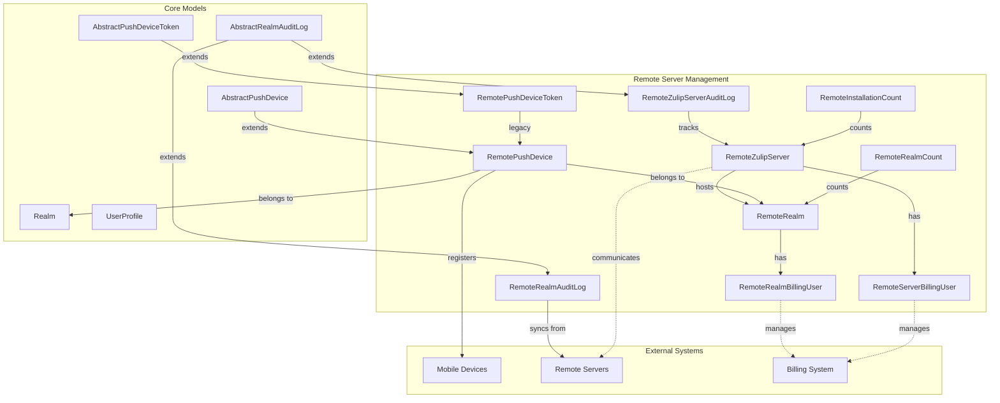
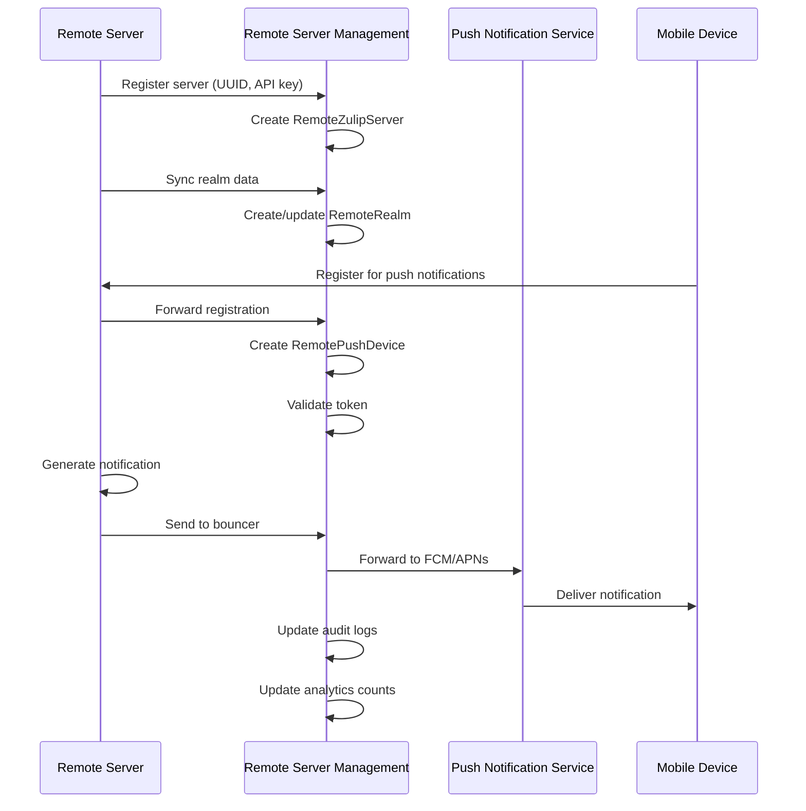
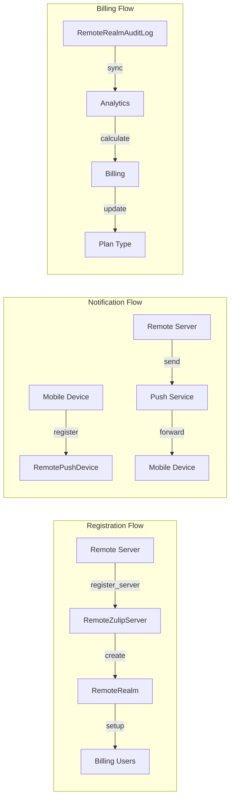
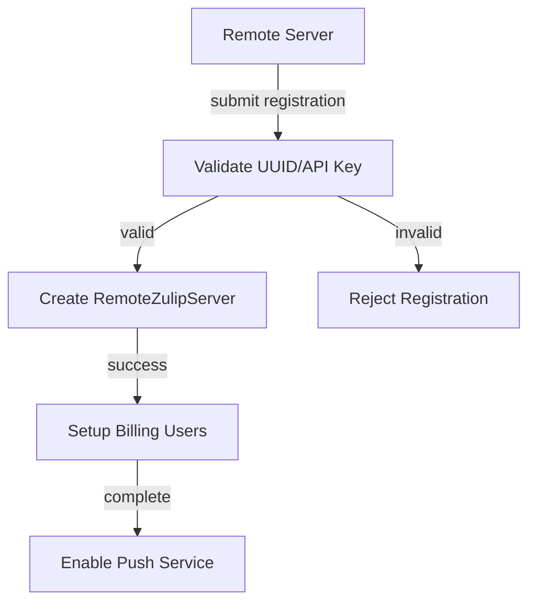
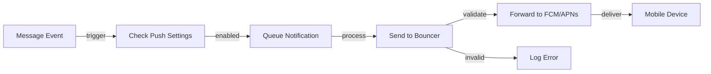
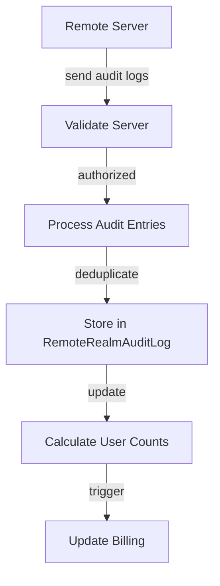

# Remote Server Management Module

## Introduction

The Remote Server Management module is a critical component of the Zulip ecosystem that enables the Mobile Push Notifications Service to manage and interact with self-hosted Zulip servers. This module provides the infrastructure for tracking remote servers, managing billing relationships, handling push device registrations, and synchronizing audit logs for billing purposes.

## Architecture Overview

The module serves as the bridge between Zulip's cloud infrastructure and self-hosted installations, facilitating secure communication, billing management, and push notification delivery for remote deployments.



## Core Components

### RemoteZulipServer

The central entity representing a self-hosted Zulip server registered with the push notifications service. Each remote server is identified by a unique UUID and API key pair, and maintains metadata about the server's configuration, version, and billing status.

**Key Features:**
- Unique server identification via UUID and API key
- Plan type management for billing tiers
- Rate limiting integration
- Audit log tracking
- Contact information for abuse handling

**Billing Plan Types:**
- `PLAN_TYPE_SELF_MANAGED` (100): Default self-managed hosting
- `PLAN_TYPE_SELF_MANAGED_LEGACY` (101): Legacy self-managed
- `PLAN_TYPE_COMMUNITY` (102): Community edition
- `PLAN_TYPE_BASIC` (103): Basic commercial plan
- `PLAN_TYPE_BUSINESS` (104): Business plan
- `PLAN_TYPE_ENTERPRISE` (105): Enterprise plan

### RemoteRealm

Represents individual realms (organizations) hosted on remote Zulip servers. This model tracks realm-specific information including authentication methods, organization type, and registration status.

**Key Features:**
- Links realms to their hosting server
- Tracks realm-specific billing and configuration
- Manages registration and deactivation states
- Supports both pre-8.0 and modern server versions

### RemotePushDevice

The core table for managing mobile push notification registrations on the bouncer server. This model stores device tokens and links them to both cloud and self-hosted realms.

**Key Features:**
- End-to-end encryption support
- Multi-realm device support
- Token expiration handling
- Platform-specific configurations (iOS app IDs)

### RemotePushDeviceToken

Legacy model for non-E2EE mobile push tokens. Maintains backward compatibility while being deprecated in favor of RemotePushDevice.

### Billing User Models

#### RemoteRealmBillingUser
Manages billing users for specific realms on remote servers, including user preferences for email notifications and terms of service acceptance.

#### RemoteServerBillingUser
Manages billing users at the server level, similar to RemoteRealmBillingUser but for entire server installations.

### Audit Log Models

#### RemoteZulipServerAuditLog
Authoritative storage for server-level audit events, primarily for billing and registration tracking.

#### RemoteRealmAuditLog
Synced audit data from remote servers, used for billing calculations and user activity tracking.

### Analytics Models

#### RemoteInstallationCount
Tracks server-wide metrics and statistics, including push notification forwarding counts.

#### RemoteRealmCount
Tracks realm-specific metrics, supporting both synced data from remote servers and locally generated statistics.

## Data Flow Architecture



## Component Interactions



## Key Functions and Utilities

### User Count Calculations

The module provides sophisticated user counting mechanisms for billing purposes:

```python
# Get user counts for entire server
get_remote_server_guest_and_non_guest_count(server_id, event_time)

# Get user counts for specific realm
get_remote_realm_guest_and_non_guest_count(remote_realm, event_time)

# Process audit logs for user counts
get_remote_customer_user_count(audit_logs)
```

### Rate Limiting

Remote servers are subject to rate limiting through the `RateLimitedRemoteZulipServer` class, which integrates with Zulip's rate limiting framework.

### Server Lookup

```python
# Find server by UUID
get_remote_server_by_uuid(uuid)
```

## Integration Points

### Corporate Billing Integration

The module integrates with the [corporate billing system](corporate_billing.md) through:
- Plan type management
- User count calculations
- Billing user management
- Audit log synchronization

### Core Models Integration

Leverages core Zulip models for:
- Realm and user management ([core_models.md](core_models.md))
- Push device abstractions
- Audit log frameworks
- Rate limiting infrastructure

### Analytics Integration

Works with the [analytics module](analytics.md) to provide:
- Installation-wide metrics
- Realm-specific statistics
- Push notification tracking
- Usage analytics

## Security Considerations

### Authentication
- API key-based authentication for remote servers
- UUID-based server identification
- Secure token handling for push notifications

### Data Privacy
- End-to-end encryption support for push notifications
- Secure handling of user data across server boundaries
- Audit trail for all server interactions

### Rate Limiting
- API rate limiting by remote server
- Protection against abuse and excessive requests
- Configurable rate limits per server

## Database Schema Design

### Key Constraints
- Unique server UUID and API key combinations
- Unique device token registrations
- Unique audit log entries per server/remote ID
- Complex unique constraints for analytics data

### Indexes
- Optimized queries for server and realm lookups
- Efficient audit log synchronization
- Fast analytics data retrieval
- Push device token queries

## Process Flows

### Server Registration Process



### Push Notification Delivery



### Audit Log Synchronization



## Dependencies

### Internal Dependencies
- **Core Models**: Extends abstract models for push devices and audit logs
- **Corporate Billing**: Integrates with billing session management
- **Analytics**: Shares base count models and analytics infrastructure
- **Rate Limiting**: Uses Zulip's rate limiting framework

### External Dependencies
- Django ORM for database operations
- Django authentication and validation
- Standard library datetime and UUID handling

## Future Considerations

### Migration Path
- Gradual deprecation of RemotePushDeviceToken in favor of RemotePushDevice
- Enhanced E2EE support for all push notifications
- Improved audit log synchronization efficiency

### Scalability
- Optimized queries for large-scale remote server deployments
- Efficient handling of bulk operations
- Caching strategies for frequently accessed data

### Security Enhancements
- Enhanced authentication mechanisms
- Improved token management
- Better abuse detection and prevention

This module forms the backbone of Zulip's ability to provide push notification services to self-hosted installations while maintaining security, billing accuracy, and operational efficiency across the entire ecosystem.