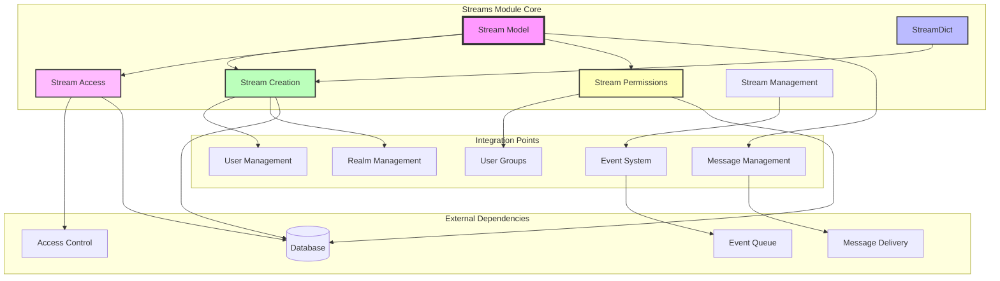
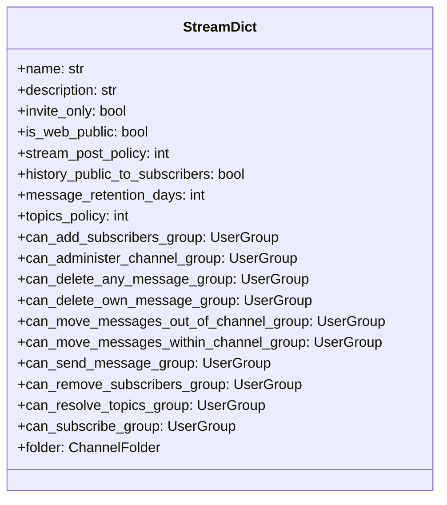
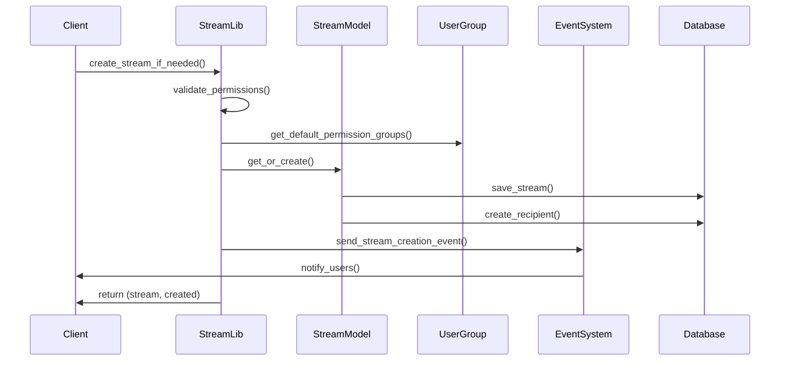
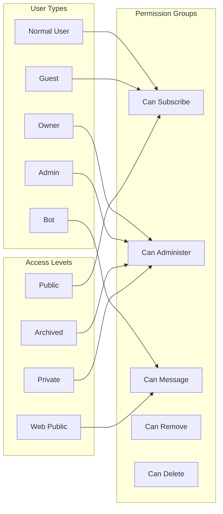
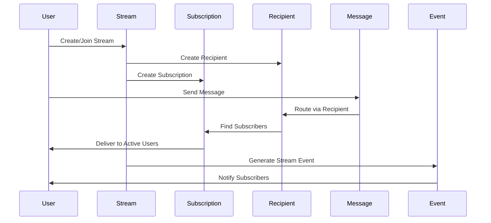
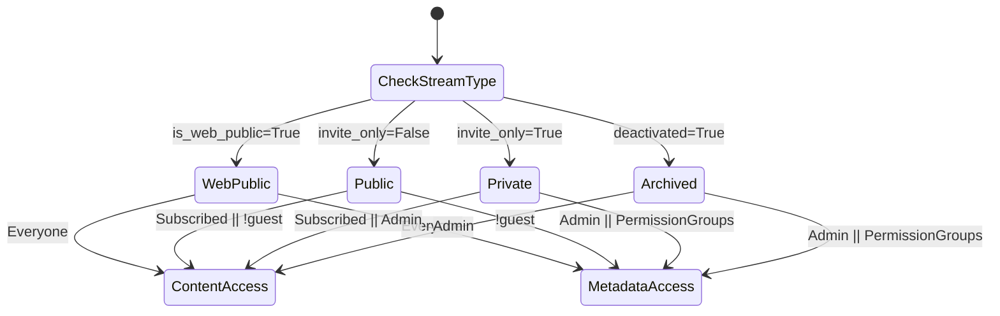
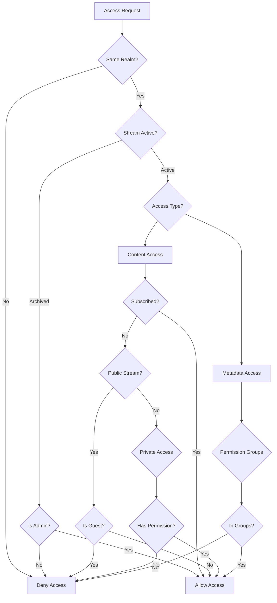
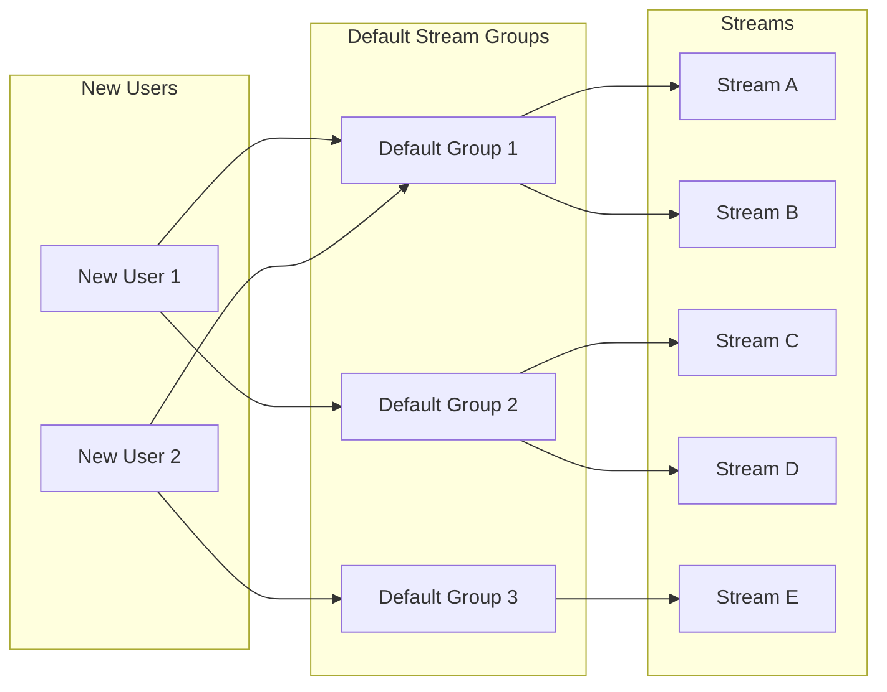

# Streams Module Documentation

## Introduction

The streams module is a core component of the Zulip messaging platform that manages channels (streams) - the fundamental organizational units for grouping messages and users. This module provides comprehensive functionality for stream creation, management, access control, permissions, and user interactions within channels.

Streams serve as the primary mechanism for organizing conversations in Zulip, supporting various privacy levels (public, private, web-public), granular permission controls, and sophisticated access management through user groups. The module integrates deeply with Zulip's security model, real-time event system, and user management infrastructure.

## Architecture Overview

## Core Components

### StreamDict Type Definition

The `StreamDict` TypedDict serves as the primary data structure for stream operations, providing a flexible interface for stream creation and configuration:

### Stream Creation and Management

The module provides sophisticated stream creation capabilities with comprehensive validation and permission checking:

### Access Control System

The streams module implements a multi-layered access control system:

## Data Flow Architecture

## Permission Management

### Granular Permission System

The module implements a sophisticated permission system using user groups for fine-grained access control:

```mermaid
graph TB
    subgraph "Permission Settings"
        CAS[can_add_subscribers_group]
        CAC[can_administer_channel_group]
        CDM[can_delete_any_message_group]
        CDOM[can_delete_own_message_group]
        CMMO[can_move_messages_out_of_channel_group]
        CMMW[can_move_messages_within_channel_group]
        CSM[can_send_message_group]
        CRS[can_remove_subscribers_group]
        CRT[can_resolve_topics_group]
        CSUB[can_subscribe_group]
    end

    subgraph "System Groups"
        EG[Everyone]
        NG[Nobody]
        AD[Admins]
        OW[Owners]
        MB[Members]
        GU[Guests]
    end

    subgraph "Custom Groups"
        CG1[Custom Group 1]
        CG2[Custom Group 2]
        CG3[Custom Group 3]
    end

    CAS --> EG
    CAS --> AD
    CAS --> CG1
    CAC --> OW
    CAC --> AD
    CSM --> EG
    CSM --> MB
    CRS --> AD
    CRS --> CG2
    CRT --> EG
    CRT --> CG3
```

### Permission Validation Functions

The module provides comprehensive permission validation:

- `check_stream_access_based_on_can_send_message_group()` - Validates message sending permissions
- `can_access_stream_metadata_user_ids()` - Determines metadata access
- `bulk_can_remove_subscribers_from_streams()` - Validates subscriber removal permissions
- `get_streams_to_which_user_cannot_add_subscribers()` - Identifies subscription limitations

## Stream Access Patterns

### Content vs Metadata Access

The module distinguishes between content access (reading messages) and metadata access (stream properties):

### Access Validation Flow

## Integration Points

### User Management Integration

The streams module integrates closely with the [users module](users.md) for:

- User subscription management
- Permission validation based on user roles
- Guest user access restrictions
- Bot user special handling

### Message System Integration

Integration with the [messages module](messages.md) includes:

- Message delivery to stream subscribers
- Stream-based message filtering
- Historical message access control
- Archive message handling

### Event System Integration

The module leverages the [event system](event_system.md) for:

- Real-time stream creation notifications
- Subscription change events
- Permission update notifications
- Stream property changes

### User Groups Integration

Deep integration with the [groups module](groups.md) provides:

- Permission-based access control
- System groups for default permissions
- Custom group support
- Recursive group membership resolution

## API Views and Endpoints

The streams module provides comprehensive API endpoints through the [API views](api_views.md):

### Core Stream Operations

- `create_channel()` - Create new streams with full configuration
- `get_streams_backend()` - List accessible streams
- `get_stream_backend()` - Retrieve specific stream details
- `update_stream_backend()` - Modify stream properties
- `deactivate_stream_backend()` - Archive streams

### Subscription Management

- `add_subscriptions_backend()` - Subscribe users to streams
- `remove_subscriptions_backend()` - Unsubscribe users
- `update_subscriptions_backend()` - Modify subscriptions
- `list_subscriptions_backend()` - List user subscriptions

### Permission Management

- `update_subscription_properties_backend()` - Modify subscription settings
- `get_subscribers_backend()` - List stream subscribers
- `get_stream_email_address()` - Retrieve stream email addresses

## Default Stream Groups

The module supports organizing streams into default groups for easier management:

## Stream Traffic and Analytics

The module includes traffic analysis capabilities:

- Weekly traffic calculation
- Stream activity monitoring
- Recently active status tracking
- Traffic-based stream recommendations

## Error Handling and Validation

Comprehensive error handling includes:

- `ChannelExistsError` - Stream name conflicts
- `CannotAdministerChannelError` - Permission violations
- `CannotSetTopicsPolicyError` - Topic policy conflicts
- `JsonableError` - General validation errors
- `OrganizationOwnerRequiredError` - Owner-only operations

## Security Considerations

### Access Control Security

- Realm isolation prevents cross-realm access
- Guest user restrictions on private streams
- Permission group validation prevents privilege escalation
- Admin override capabilities for emergency access

### Data Protection

- Stream metadata access controls
- Message history protection
- Subscription privacy
- Web-public stream content exposure controls

## Performance Optimizations

### Database Query Optimization

- Bulk operations for multiple streams
- Select-related queries for permission groups
- Efficient subscription checking
- Cached permission group memberships

### Event System Optimization

- Targeted event delivery to affected users
- Bulk event creation for multiple operations
- Anonymous group membership caching
- Stream traffic data batching

## Future Enhancements

### Planned Features

- Enhanced folder organization for streams
- Advanced permission inheritance
- Stream templates and cloning
- Integration with external collaboration tools
- Advanced analytics and insights

### Scalability Improvements

- Distributed stream metadata caching
- Optimized permission group resolution
- Stream sharding for large organizations
- Enhanced bulk operation performance

## Related Documentation

- [Realms Module](realms.md) - Multi-tenancy and realm management
- [Users Module](users.md) - User profiles and authentication
- [Messages Module](messages.md) - Message handling and routing
- [Event System](event_system.md) - Real-time event handling
- [API Views](api_views.md) - API endpoint implementations
- [Core Libraries](core_libraries.md) - Supporting data structures and utilities

---

This documentation provides a comprehensive overview of the streams module's architecture, functionality, and integration points within the Zulip platform. The module's sophisticated permission system, flexible access controls, and comprehensive API make it a robust foundation for channel-based communication in enterprise environments.