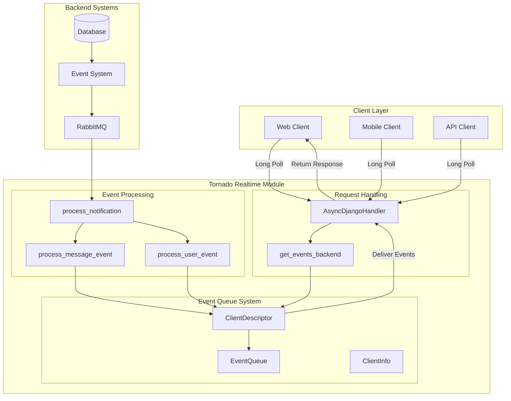
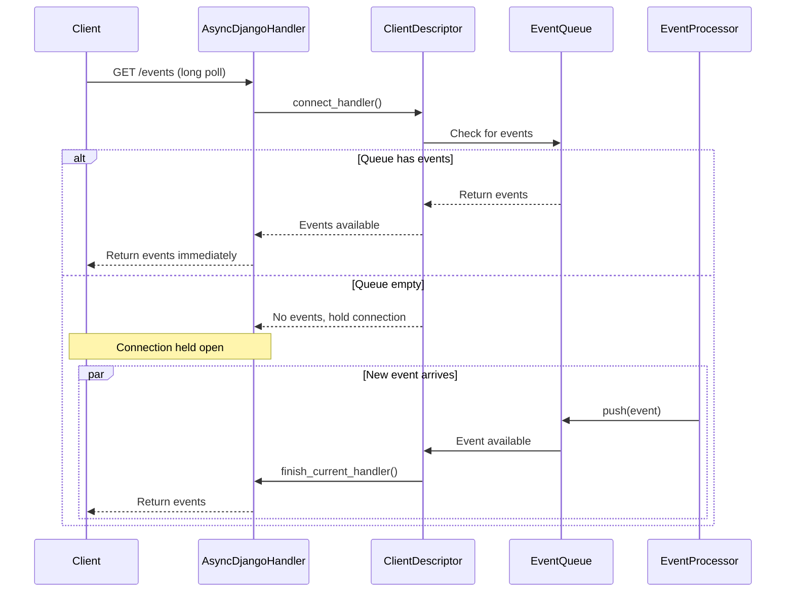

# Tornado Realtime Module Documentation

## Overview

The `tornado_realtime` module is the core real-time event delivery system in Zulip, built on top of the Tornado web framework. It provides long-polling capabilities for real-time message delivery, event streaming, and client connection management. This module is responsible for maintaining persistent connections with clients and delivering events (messages, presence updates, typing notifications, etc.) in real-time.

## Architecture

The tornado_realtime module consists of three main components that work together to provide real-time event delivery:

### Core Components

1. **Event Queue System** (`zerver.tornado.event_queue`)
   - Manages event queues for connected clients
   - Handles event filtering, storage, and delivery
   - Implements virtual events for optimization
   - Provides garbage collection for expired queues

2. **Async Request Handlers** (`zerver.tornado.handlers`)
   - Bridges Django and Tornado frameworks
   - Manages long-polling HTTP connections
   - Handles asynchronous request processing
   - Converts between Django HttpRequest and Tornado RequestHandler

3. **Event Views** (`zerver.tornado.views`)
   - Provides REST API endpoints for event operations
   - Handles client registration and event fetching
   - Manages queue lifecycle operations
   - Implements cross-shard communication

## System Architecture



## Event Flow



## Key Features

### 1. Long-Polling Architecture
- Maintains persistent HTTP connections with clients
- Implements server-side timeouts with heartbeat events
- Supports connection resumption and queue recovery
- Handles client disconnections gracefully

### 2. Event Queue Management
- Per-client event queues with configurable timeouts
- Virtual events for efficient batching (e.g., read receipts)
- Event filtering based on client capabilities
- Garbage collection of expired queues

### 3. Cross-Shard Support
- Supports horizontal scaling across multiple Tornado processes
- Implements queue sharding by user
- Cross-shard event forwarding via RabbitMQ
- Load balancing with nginx X-Accel-Redirect

### 4. Client Capability Negotiation
- Dynamic event filtering based on client capabilities
- Backwards compatibility for older clients
- Feature flags for new functionality
- Graceful degradation for unsupported features

## Event Types

The system handles various event types including:

- **Message Events**: New messages, message edits, message deletions
- **Presence Events**: User status updates, availability changes
- **Typing Notifications**: Real-time typing indicators
- **Stream Events**: Channel creation, updates, archiving
- **User Events**: Profile updates, group membership changes
- **System Events**: Server restarts, configuration updates

## Performance Optimizations

### Virtual Events
The system compresses similar events (like multiple read receipts) into virtual events to reduce network overhead:

```python
# Multiple read flag updates are compressed
virtual_events = {
    "flags/add/read": {
        "messages": [1, 2, 3, 4, 5],  # Combined message IDs
        "timestamp": 1234567890
    }
}
```

### Event Batching
- Events are batched when possible to reduce HTTP response overhead
- Virtual events are resolved before delivery to clients
- Internal data is pruned from API responses

### Memory Management
- Automatic garbage collection of expired queues
- Configurable queue timeouts (default: 10 minutes, max: 7 days)
- Periodic cleanup of disconnected handlers

## Integration Points

### Event System Integration
The tornado_realtime module integrates with Zulip's broader event system:

- **Event Generation**: Events are created by various Zulip subsystems
- **Event Distribution**: Events are published to RabbitMQ for multi-process delivery
- **Event Processing**: The `process_notification` function handles incoming events
- **Client Delivery**: Events are filtered and delivered to appropriate clients

### Database Integration
- Client descriptors are serialized to disk for persistence across restarts
- Queue state is maintained in memory with periodic disk snapshots
- User and realm data is cached for efficient access

### Authentication Integration
- Leverages Django's authentication system
- Supports multiple authentication backends
- Implements internal API authentication for cross-service communication

## Configuration

Key configuration parameters:

- `DEFAULT_EVENT_QUEUE_TIMEOUT_SECS`: 600 seconds (10 minutes)
- `MAX_QUEUE_TIMEOUT_SECS`: 604800 seconds (7 days)
- `HEARTBEAT_MIN_FREQ_SECS`: 45 seconds
- `EVENT_QUEUE_GC_FREQ_MSECS`: 60000 milliseconds (1 minute)

## Monitoring and Observability

The module provides extensive logging for:
- Queue creation and destruction
- Event processing performance
- Connection lifecycle events
- Error conditions and exceptions

## Security Considerations

- Queue access is validated against user permissions
- Cross-shard requests are authenticated
- Event filtering prevents unauthorized data access
- Rate limiting is applied to prevent abuse

## Related Documentation

- [Event Queue System Technical Reference](event_queue_system.md) - Detailed technical documentation of the event queue implementation
- [Event System Documentation](event_system.md) - Overview of Zulip's event system
- [Message Actions Documentation](message_actions.md) - Message processing and delivery
- [Core Models Documentation](core_models.md) - Data models and relationships