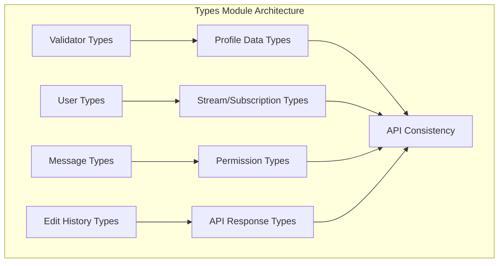
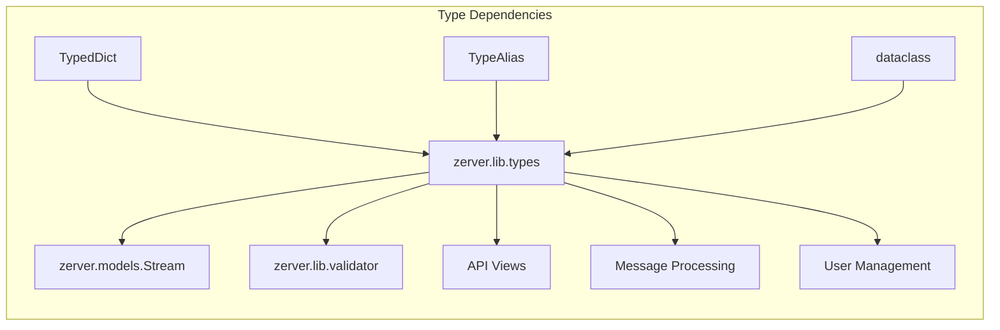
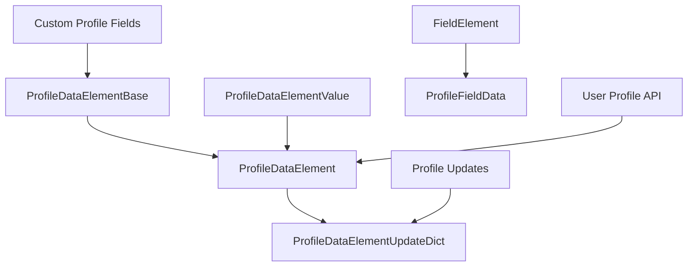
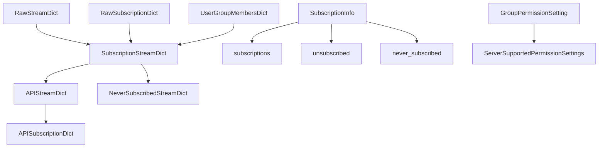
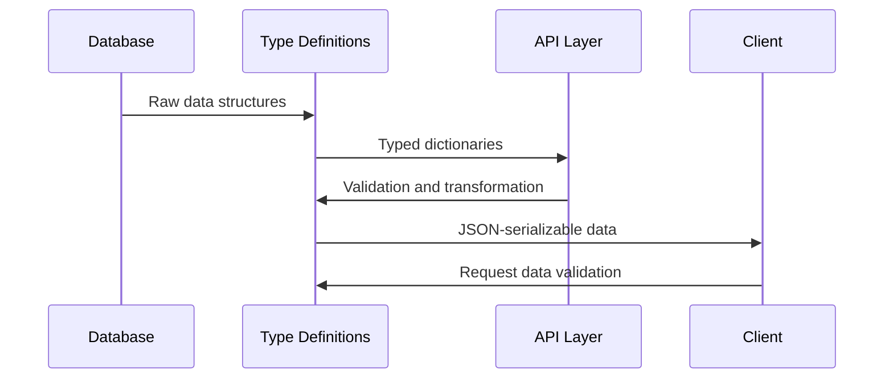
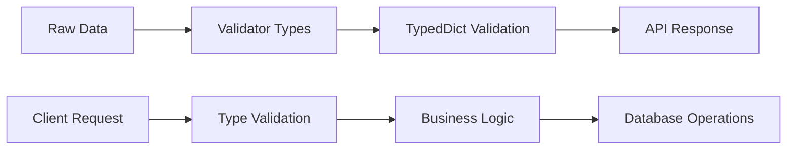

# Types Module Documentation

## Introduction

The `types` module (`zerver/lib/types.py`) serves as the central type definition repository for the Zulip codebase. It provides comprehensive type annotations, TypedDict definitions, and data structures that ensure type safety across the entire application. This module is fundamental to Zulip's API consistency, data validation, and developer experience.

## Architecture Overview

The types module is organized into several logical categories that mirror Zulip's core domain concepts:

### Core Type Categories



### Type Dependencies and Relationships



## Core Components

### 1. Validator Types

The module defines foundational validator types that are used throughout Zulip for data validation:

```python
# Core validator type definitions
Validator: TypeAlias = Callable[[str, object], ResultT]
ExtendedValidator: TypeAlias = Callable[[str, str, object], str]
RealmUserValidator: TypeAlias = Callable[[int, object, bool], list[int]]
```

These validators are extensively used in:
- [Profile data validation](core_models.md#profile-data-management)
- [API request processing](api_views.md)
- [Form validation](authentication_and_backends.md)

### 2. Profile Data Types

Profile data types handle user profile customization and custom profile fields:



**Key Types:**
- `ProfileDataElement`: Complete profile field with value and rendered value
- `ProfileDataElementBase`: Base structure for profile field definitions
- `ProfileDataElementValue`: Union type supporting strings and list of integers

### 3. User and Display Types

User-related types handle user representation and display information:

```python
class UserDisplayRecipient(TypedDict):
    email: str
    full_name: str
    id: int
    is_mirror_dummy: bool

DisplayRecipientT: TypeAlias = str | list[UserDisplayRecipient]
```

These types are crucial for:
- [Message recipient handling](core_models.md#message-recipients)
- [User search and display](core_models.md#user-management)
- [API user data serialization](api_views.md#user-endpoints)

### 4. Stream and Subscription Types

The most complex type hierarchy handles streams, subscriptions, and their various representations:



**Stream Type Hierarchy:**
1. **RawStreamDict**: Direct database representation
2. **RawSubscriptionDict**: User-specific subscription settings
3. **SubscriptionStreamDict**: Combined stream + subscription data
4. **APIStreamDict**: API-ready stream representation
5. **APISubscriptionDict**: Complete subscription data for API

### 5. User Topic Management

```python
class UserTopicDict(TypedDict, total=False):
    stream_id: int
    stream__name: str
    topic_name: str
    last_updated: int
    visibility_policy: int
```

Used in [message topic management](core_models.md#topic-handling) and [user preferences](core_models.md#user-preferences).

### 6. Edit History Types

Handles message edit history tracking:

```python
class EditHistoryEvent(TypedDict, total=False):
    user_id: int | None
    timestamp: int
    prev_stream: int
    stream: int
    prev_topic: str
    topic: str
    prev_content: str
    prev_rendered_content: str | None
    prev_rendered_content_version: int | None
```

Integrated with [message editing functionality](message_actions.md#message-edit).

### 7. Permission and Group Types

```python
@dataclass
class GroupPermissionSetting:
    allow_nobody_group: bool
    allow_everyone_group: bool
    default_group_name: str
    require_system_group: bool = False
    allow_internet_group: bool = False
    default_for_system_groups: str | None = None
    allowed_system_groups: list[str] = field(default_factory=list)
```

These types support [user group management](core_models.md#user-groups) and [permission systems](authentication_and_backends.md).

## Data Flow and Integration

### API Data Flow



### Type Validation Pipeline



## Key Features and Benefits

### 1. Type Safety
- Comprehensive type annotations prevent runtime errors
- TypedDict ensures API contract consistency
- Type aliases provide semantic meaning

### 2. API Consistency
- Standardized response formats across endpoints
- Consistent field naming and structure
- Version-safe type definitions

### 3. Developer Experience
- IDE autocomplete and type checking
- Clear documentation through type hints
- Reduced debugging time

### 4. Performance Optimization
- Efficient data structures for serialization
- Minimal overhead in type validation
- Optimized for Django's ORM integration

## Integration with Other Modules

### Core Models Integration
The types module provides the type layer for [core models](core_models.md):
- User profile data types → User model
- Stream/subscription types → Stream and Subscription models
- Message types → Message model representations

### API Views Integration
Types support [API endpoints](api_views.md) by providing:
- Request validation types
- Response serialization formats
- Error handling structures

### Message System Integration
Types enable [message processing](message_actions.md) through:
- Edit history tracking
- Message recipient handling
- Content validation types

### Authentication Integration
Types support [authentication systems](authentication_and_backends.md) via:
- User data validation
- Profile field types
- External auth data structures

## Usage Examples

### Profile Data Handling
```python
# Defining custom profile fields
profile_field: ProfileDataElement = {
    "id": 1,
    "name": "Department",
    "type": 1,  # Short text field
    "value": "Engineering",
    "rendered_value": "<p>Engineering</p>"
}

# Updating profile data
update: ProfileDataElementUpdateDict = {
    "id": 1,
    "value": "Product Engineering"
}
```

### Stream Subscription Management
```python
# User subscription information
subscription_info: SubscriptionInfo = {
    "subscriptions": [subscription_dict1, subscription_dict2],
    "unsubscribed": [unsubscribed_dict1],
    "never_subscribed": [never_subscribed_dict1]
}

# Stream data for API response
api_stream: APIStreamDict = {
    "stream_id": 123,
    "name": "general",
    "description": "General discussion",
    "stream_weekly_traffic": 150
}
```

### User Topic Preferences
```python
# User topic visibility settings
user_topic: UserTopicDict = {
    "stream_id": 123,
    "stream__name": "general",
    "topic_name": "welcome",
    "last_updated": 1640995200,
    "visibility_policy": 1  # Normal visibility
}
```

## Best Practices

### 1. Type Definition Guidelines
- Use `TypedDict` for API response structures
- Use `dataclass` for internal data structures
- Use `TypeAlias` for complex type combinations
- Document type purposes with docstrings

### 2. Validation Patterns
- Always validate external data against defined types
- Use validator functions for complex validation logic
- Handle `None` and optional fields explicitly
- Provide meaningful error messages

### 3. API Compatibility
- Maintain backward compatibility in type definitions
- Use `total=False` for optional TypedDict fields
- Version type definitions when making breaking changes
- Document deprecated fields clearly

## Migration and Versioning

### Type Evolution Strategy
- Add new fields as optional (`total=False`)
- Deprecate fields gracefully with documentation
- Provide migration guides for breaking changes
- Maintain type definition history

### Compatibility Considerations
- Client-server type compatibility
- Database schema alignment
- API version handling
- External integration compatibility

## Testing and Validation

### Type Testing Approach
- Static type checking with mypy
- Runtime validation testing
- API contract testing
- Serialization/deserialization testing

### Validation Integration
- Unit tests for validator functions
- Integration tests for type conversions
- API tests for response formats
- Performance tests for large datasets

## Conclusion

The types module is the foundation of Zulip's type system, providing essential type definitions that ensure consistency, safety, and maintainability across the entire codebase. Its comprehensive type definitions support everything from basic data validation to complex API responses, making it an indispensable part of the Zulip architecture.

The module's design emphasizes:
- **Type safety** through comprehensive annotations
- **API consistency** via standardized structures
- **Developer experience** with clear documentation
- **Performance** through efficient data structures
- **Maintainability** with well-organized type hierarchies

By centralizing type definitions, the types module enables Zulip to maintain high code quality while supporting a rich feature set across web, mobile, and API interfaces.