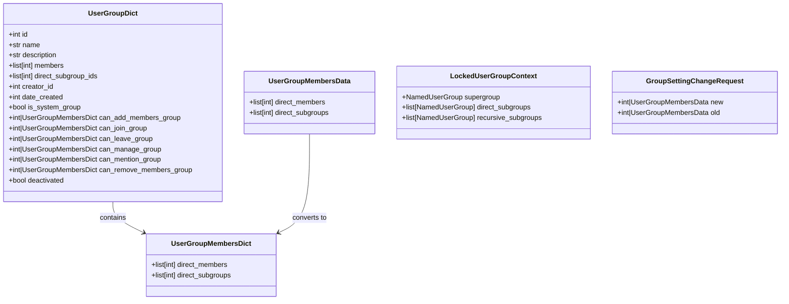
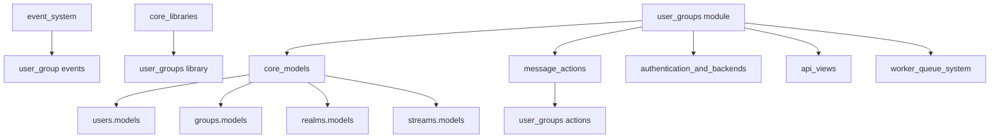
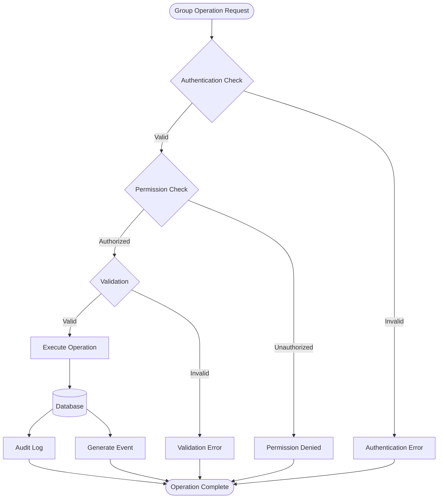
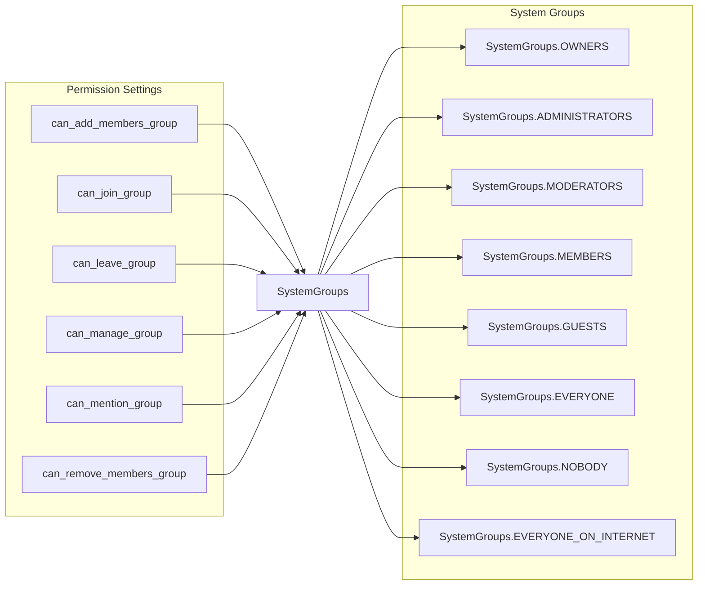
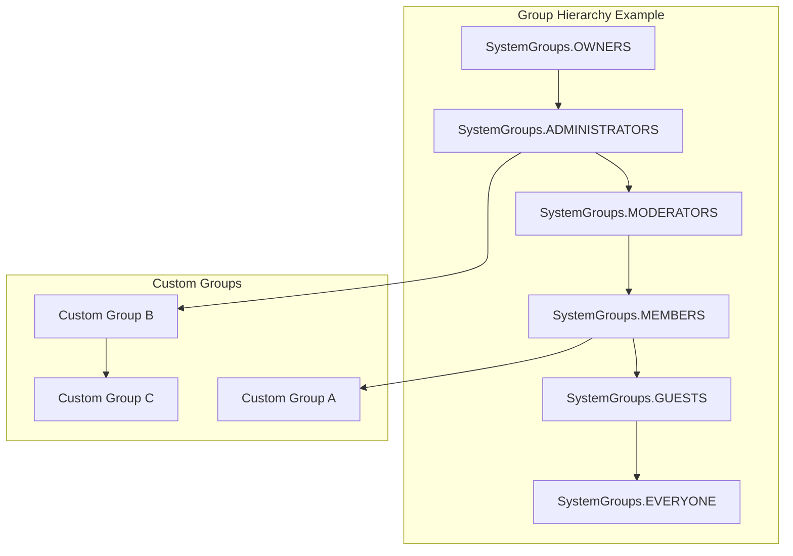
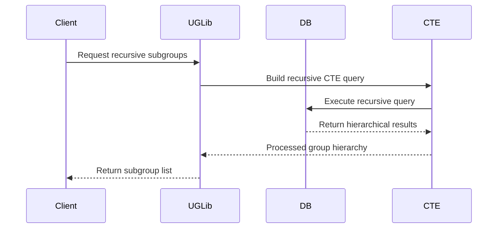
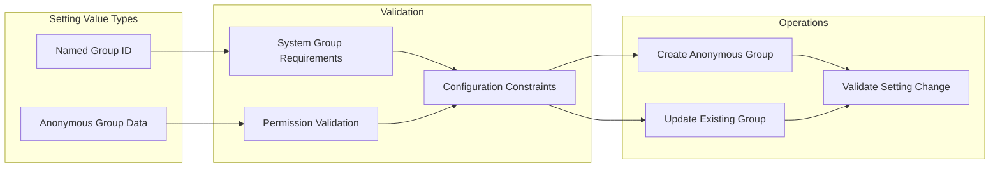
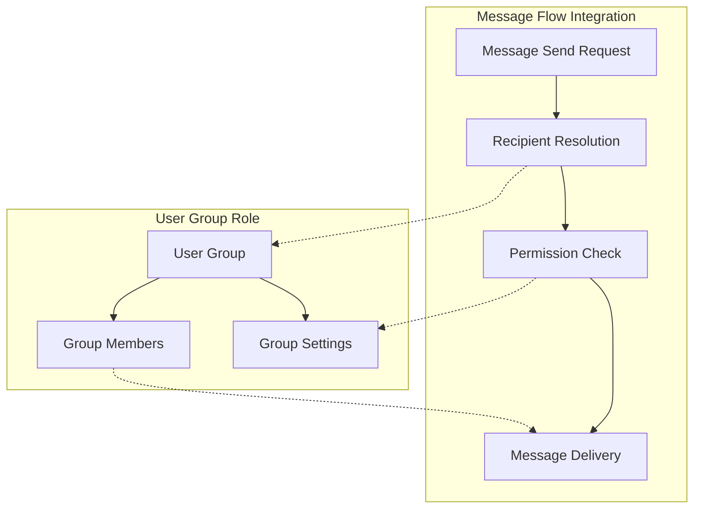
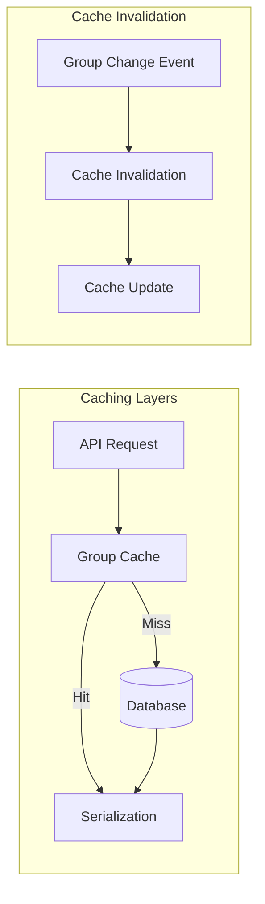

# User Groups Module Documentation

## Introduction

The user_groups module is a core component of the Zulip messaging platform that manages user group functionality, including group creation, membership management, permissions, and hierarchical group relationships. This module provides the foundation for organizing users into logical groups for streamlined permission management, messaging, and administrative control within realms (organizations).

The module implements a sophisticated permission system that supports both named user groups and anonymous groups, with support for nested group hierarchies and fine-grained permission settings that can be applied to various system resources including streams, realms, and other user groups.

## Architecture Overview

### Core Components

The user_groups module consists of several key architectural layers:

1. **Data Models Layer**: Defines the database schema for user groups, memberships, and relationships
2. **Access Control Layer**: Implements permission checking and security controls
3. **Business Logic Layer**: Handles group operations, membership management, and hierarchical relationships
4. **API Interface Layer**: Provides data structures and utilities for external consumption

### Key Data Structures

## Module Dependencies

The user_groups module has extensive dependencies across the Zulip system:

### Dependency Details

- **Core Models**: Depends on UserProfile, Realm, Stream, and other fundamental models
- **Message Actions**: Integrates with message sending and editing workflows
- **Event System**: Generates events for real-time group membership updates
- **Authentication**: Leverages user roles and permissions from authentication system
- **API Views**: Provides data to REST API endpoints
- **Worker System**: Handles background tasks for group operations

## Core Functionality

### Group Management Operations

### Permission System Architecture

The module implements a sophisticated permission system with the following characteristics:

### Hierarchical Group Relationships

## Key Functions and Operations

### Access Control Functions

The module provides several layers of access control:

1. **Basic Access Checks**:
   - `has_user_group_access_for_subgroup()`: Validates group visibility for subgroup operations
   - `get_user_group_by_id_in_realm()`: Retrieves groups with realm validation
   - `access_user_group_to_read_membership()`: Read-only access for membership queries

2. **Permission-Based Access**:
   - `access_user_group_for_update()`: Main entry point for modification operations
   - `access_user_group_for_deactivation()`: Specialized access for deactivation
   - `user_has_permission_for_group_setting()`: Permission validation for specific settings

3. **System Group Management**:
   - `get_system_user_group_by_name()`: Retrieves system groups by name
   - `get_system_user_group_for_user()`: Maps users to their role-based system group
   - `create_system_user_groups_for_realm()`: Initializes system groups for new realms

### Group Hierarchy and Membership

The module implements sophisticated recursive queries for group relationships:

Key functions include:
- `get_recursive_subgroups()`: Gets all subgroups recursively
- `get_recursive_group_members()`: Gets all members of a group hierarchy
- `get_recursive_membership_groups()`: Gets all groups a user belongs to
- `lock_subgroups_with_respect_to_supergroup()`: Prevents circular dependencies

### Permission Setting Management

The module handles complex permission settings with support for both named and anonymous groups:

## Integration with Other Modules

### Event System Integration

The user_groups module integrates with the event system to provide real-time updates:

- **Group Creation Events**: Notifies clients when new groups are created
- **Membership Change Events**: Updates clients when group membership changes
- **Permission Setting Events**: Propagates permission changes to affected users
- **Deactivation Events**: Handles group deactivation and cleanup

### Message System Integration

User groups play a crucial role in message delivery and permissions:

### Stream Management Integration

User groups are extensively used in stream permission management:

- **Stream Creation**: Groups can be used to control who can create streams
- **Stream Subscription**: Groups determine subscription permissions
- **Stream Administration**: Group-based permissions for stream management
- **Message Posting**: Groups control posting permissions within streams

## Performance Considerations

### Database Optimization

The module implements several performance optimizations:

1. **Recursive CTE Queries**: Uses PostgreSQL CTE for efficient hierarchical queries
2. **Bulk Operations**: Implements bulk create/update operations for system groups
3. **Selective Loading**: Uses `select_related` and `prefetch_related` for optimal queries
4. **Atomic Transactions**: Ensures data consistency with proper transaction management

### Caching Strategy

## Security Considerations

### Access Control Matrix

The module implements a comprehensive access control system:

| Operation | System Groups | Custom Groups | Anonymous Groups |
|-----------|---------------|---------------|------------------|
| Create | Realm admins+ | Can manage groups | N/A |
| Modify | System only | Can manage group | Can manage group |
| Delete | Never | Can manage group | Can manage group |
| View | Everyone | Group visibility | Setting dependent |

### Permission Validation

All group operations undergo rigorous permission validation:

1. **Realm Isolation**: Ensures groups cannot cross realm boundaries
2. **Role-Based Checks**: Validates user roles against system group requirements
3. **Setting Constraints**: Enforces configuration rules for permission settings
4. **Circular Dependency Prevention**: Locks groups to prevent hierarchy cycles

## Error Handling

The module implements comprehensive error handling with specific exception types:

- **CannotDeactivateGroupInUseError**: Group is referenced by active settings
- **JsonableError**: General API error with user-friendly messages
- **PreviousSettingValueMismatchedError**: Prevents race conditions in updates
- **SystemGroupRequiredError**: Enforces system group requirements

## Future Considerations

### Scalability

The module is designed to handle large-scale deployments:

- **Hierarchical Queries**: CTE-based queries scale well with group depth
- **Bulk Operations**: Efficient handling of large group memberships
- **Selective Loading**: Minimizes database query overhead
- **Atomic Operations**: Prevents performance degradation from conflicts

### Extensibility

The architecture supports future enhancements:

- **New Permission Types**: Extensible permission setting framework
- **Custom Group Types**: Support for specialized group categories
- **Advanced Hierarchies**: Flexible group relationship models
- **Integration Points**: Well-defined interfaces for new features

## Related Documentation

- [Core Models Documentation](core_models.md) - Base data models and relationships
- [Message Actions Documentation](message_actions.md) - Integration with messaging system
- [Event System Documentation](event_system.md) - Real-time event handling
- [Authentication Documentation](authentication_and_backends.md) - User role and permission system
- [API Views Documentation](api_views.md) - REST API integration points

## Conclusion

The user_groups module provides a robust, scalable foundation for user group management within the Zulip platform. Its sophisticated permission system, hierarchical group support, and comprehensive integration with other system components make it a critical part of the platform's organizational and security infrastructure. The module's design emphasizes data consistency, performance, and extensibility, ensuring it can support both current requirements and future enhancements.