# Users Module Documentation

## Introduction

The users module is a core component of the Zulip chat system that manages user profiles, authentication, and user-related operations. It provides comprehensive functionality for user management including profile updates, user deactivation/reactivation, bot management, and avatar handling. The module serves as the central hub for all user-related API endpoints and business logic, extending beyond basic user profiles to include sophisticated bot management, role-based permissions, and extensive user preferences within Zulip organizations (realms).

## Architecture Overview

The users module implements a comprehensive user management system built on Django's authentication framework with Zulip-specific extensions. The architecture follows a layered pattern with clear separation between API views, business logic, and data access layers, centered around the `UserProfile` model which extends Django's authentication system.


### User Management API Endpoints

The module provides RESTful API endpoints for user management operations:


#### Key API Functions:

- **`get_members_backend`**: Retrieves user data with optional filtering and field selection
- **`get_member_backend`**: Retrieves specific user data by ID
- **`create_user_backend`**: Creates new users (admin-only functionality)
- **`update_user_by_id_api`**: Updates user information by user ID with full validation
- **`update_user_by_email_api`**: Updates user information by email address
- **`deactivate_user_backend`**: Deactivates user accounts with optional notification
- **`reactivate_user_backend`**: Reactivates previously deactivated users
- **`get_profile_backend`**: Returns the current user's complete profile data

### Bot Management System

Comprehensive bot management functionality for automated users:


#### Bot Types Supported:
- **Default Bot** (`UserProfile.DEFAULT_BOT`): Standard automated user
- **Incoming Webhook Bot** (`UserProfile.INCOMING_WEBHOOK_BOT`): For external integrations
- **Outgoing Webhook Bot** (`UserProfile.OUTGOING_WEBHOOK_BOT`): For sending data to external services
- **Embedded Bot** (`UserProfile.EMBEDDED_BOT`): For custom integrations

#### Bot Management Functions:

- **`add_bot_backend`**: Creates new bots with full configuration
- **`patch_bot_backend`**: Updates existing bot settings, owner, and configuration
- **`regenerate_bot_api_key`**: Generates new API keys for bots
- **`get_bots_backend`**: Lists all bots owned by the current user
- **`deactivate_bot_backend`**: Deactivates bot accounts

### Avatar Management System

Flexible avatar handling system supporting multiple sources:


#### Avatar Functions:

- **`avatar_by_id`**: Returns avatar by user ID with access control
- **`avatar_by_email`**: Returns avatar by email address with fallback to Gravatar
- **`avatar_medium`**: Returns medium-sized avatars (50x50 pixels)

### Profile Data Management

Structured profile data handling with custom fields:


#### Profile Data Functions:

- **`ProfileDataElement`**: Pydantic model for profile field validation
- **`update_user_backend`**: Core function for updating user profiles with validation
- **`validate_user_custom_profile_data`**: Validates custom profile field data
- **`do_update_user_custom_profile_data_if_changed`**: Applies profile data changes

### User Subscription Management


- **`get_subscription_backend`**: Checks if a user is subscribed to a specific stream

## Data Flow Architecture

### User Creation Flow


### User Update Flow


### Bot Creation Flow


### UserProfile Model

The `UserProfile` model is the central entity in the users module, representing individual users within Zulip organizations. It extends Django's authentication system with Zulip-specific features including role-based permissions, bot management, and extensive user preferences.

**Key Features:**
- **Dual Email System**: Maintains both `email` (public-facing) and `delivery_email` (actual email for notifications) to support privacy controls
- **Role-Based Access Control**: Implements a hierarchical permission system with roles from Guest (600) to Realm Owner (100)
- **Bot Management**: Supports multiple bot types (Default, Incoming Webhook, Outgoing Webhook, Embedded)
- **Comprehensive Settings**: Extends `UserBaseSettings` for UI preferences, notification settings, and privacy controls
- **Authentication**: Integrates with various authentication backends through API keys and external auth methods

## Security and Permissions

### Role-Based Access Control

The module implements a sophisticated permission system based on user roles and group-based permissions:


### Security Validations

- **Email Validation**: Domain restrictions, disposable email detection, plus address filtering
- **Password Strength**: Configurable password requirements with strength validation
- **User Access**: Cross-realm access prevention with `check_can_access_user`
- **Role Permissions**: Hierarchical permission system with owner protection
- **Bot Security**: Owner-based access control with type validation

### Critical Security Functions

- **`check_last_owner`**: Prevents deactivation of the last organization owner
- **`access_user_by_id`**: Enforces user access permissions with role-based checks
- **`access_user_by_email`**: Similar access control for email-based lookups
- **`access_bot_by_id`**: Specialized bot access control

### Exception Types

The module defines specific exception types for different error scenarios:

- **`CannotDeactivateLastUserError`**: Prevents deactivation of the last user or owner
- **`EmailAlreadyInUseError`**: Handles duplicate email addresses
- **`OrganizationOwnerRequiredError`**: Enforces owner-only operations
- **`OrganizationAdministratorRequiredError`**: Enforces admin permissions
- **`JsonableError`**: General error handling with user-friendly messages

## Integration Points

### UserBaseSettings Abstract Model

`UserBaseSettings` serves as an abstract container for all user preferences and personal settings. This design allows settings to be shared between individual users (`UserProfile`) and realm-level defaults (`RealmUserDefault`).

**Settings Categories:**
- **Display Settings**: Theme, layout, emoji preferences, language settings
- **Notification Settings**: Email, push, and desktop notification preferences
- **Privacy Settings**: Email visibility, typing notifications, read receipts
- **Advanced Settings**: AI features, timezone, accessibility options

### RealmUserDefault Model

Stores realm-level default values for user preferences, ensuring new users inherit appropriate settings for their organization. This enables organizations to maintain consistent user experiences and compliance requirements.

### ExternalAuthID Model

Manages external authentication identifiers, supporting integration with LDAP, SAML, OAuth providers, and other external authentication systems. Maintains the mapping between external auth identities and Zulip user profiles.

## Data Flow and Relationships

```mermaid
graph LR
    subgraph "Authentication Flow"
        EA[External Auth] --> EAI[ExternalAuthID]
        EAI --> UP[UserProfile]
        AK[API Key] --> UP
        PW[Password] --> UP
    end
    
    subgraph "Settings Inheritance"
        RUD[RealmUserDefault] --> |"defaults"| UP
        RUD --> R[Realm]
        UP --> R
    end
    
    subgraph "User Context"
        UP --> RC[Recipient]
        UP --> CF[CustomProfileField]
        UP --> B[Bot]
        UP --> G[Groups]
    end
```



## Permission System

The users module implements a sophisticated permission system based on user roles and group-based permissions:


**Role-Based Permissions:**
- **Realm Owner**: Full organizational control, including billing and user management
- **Realm Administrator**: Administrative privileges within the organization
- **Moderator**: Content moderation capabilities
- **Member**: Standard user permissions
- **Guest**: Limited access, typically for external participants

## Core Library Functions

### User Access and Validation

The `zerver.lib.users` module provides fundamental user management functionality:

#### User Access Control Functions

- **`access_user_by_id()`**: Master function for accessing users by ID with comprehensive permission checks including role-based access control, cross-realm restrictions, and administrative privileges
- **`access_user_by_email()`**: Email-based user access with privacy protection through dummy email addresses and email visibility controls
- **`access_user_by_id_including_cross_realm()`**: Specialized function for accessing cross-realm bots and system users
- **`bulk_access_users_by_id()`**: Efficient bulk user access for operations involving multiple users
- **`bulk_access_users_by_email()`**: Bulk email-based user access with validation

#### User Validation Functions

- **`check_full_name()`**: Comprehensive full name validation including length limits, character restrictions, uniqueness checks within realms, and format validation to prevent Markdown parsing issues
- **`check_bot_name_available()`**: Bot name availability verification to prevent naming conflicts
- **`check_valid_bot_config()`**: Configuration validation for different bot types including webhook integrations and embedded bots
- **`check_can_create_bot()`**: Permission validation for bot creation based on user roles and realm settings
- **`validate_user_custom_profile_data()`**: Validation of custom profile field data according to field types and permissions

#### Data Formatting and API Integration

- **`format_user_row()`**: Core function for converting database user data to API-compatible format with privacy controls and client capability support
- **`get_users_for_api()`**: Main function for preparing user data for API delivery with selective field inclusion and privacy compliance
- **`get_data_for_inaccessible_user()`**: Generates placeholder data for users that cannot be accessed due to privacy restrictions
- **`user_profile_to_user_row()`**: Converts UserProfile objects to dictionary format for efficient processing

### Advanced Access Control System

#### User Visibility Logic

The module implements sophisticated user visibility controls:


#### Privacy Protection Functions

- **`can_access_delivery_email()`**: Controls access to real email addresses based on user roles and visibility settings
- **`user_access_restricted_in_realm()`**: Determines if user access is restricted within a realm
- **`check_user_can_access_all_users()`**: Checks if a user has permission to access all organization members
- **`get_inaccessible_user_ids()`**: Identifies users that cannot be accessed by a given user
- **`get_user_ids_who_can_access_user()`**: Determines which users can access a specific target user

### Bot Management System

#### Bot Creation and Configuration

- **`check_valid_bot_type()`**: Validates bot types against allowed types for the user
- **`check_valid_interface_type()`**: Validates service interface types for bots
- **`add_service()`**: Creates outgoing webhook or embedded bot services with proper configuration
- **`get_active_bots_owned_by_user()`**: Retrieves all active bots owned by a specific user

#### Bot Service Management

The module supports various bot service configurations:
- **Incoming Webhook Bots**: Integration with external services through webhook endpoints
- **Outgoing Webhook Bots**: Bots that send data to external services
- **Embedded Bots**: Custom bots with specialized functionality
- **Service Configuration**: Validation of bot configuration data including integration-specific settings

### Cross-Realm Functionality

#### System Bot Management

- **`bulk_get_cross_realm_bots()`**: Retrieves system bots that operate across multiple realms
- **`get_cross_realm_dicts()`**: Provides formatted data for cross-realm bots with caching
- **System Bot Integration**: Special handling for notification bots, email gateway, and other system services

### Account Management

#### Multi-Realm Account Discovery

- **`get_accounts_for_email()`**: Discovers all user accounts associated with an email address across active realms
- **`Account` TypedDict**: Structured representation of user account information including realm details and avatar URLs

#### Two-Factor Authentication

- **`is_2fa_verified()`**: Safe wrapper for two-factor authentication verification that handles edge cases and disabled 2FA scenarios

## Integration Points

### Authentication Integration
The users module integrates with the [authentication_and_backends](authentication_and_backends.md) module through:
- External authentication method support via `ExternalAuthID`
- API key authentication for programmatic access
- Password authentication with strength validation
- Two-factor authentication verification through `is_2fa_verified()`

### Message System Integration
Integrates with the [message_actions](message_actions.md) and [event_system](event_system.md) modules:
- User profiles are linked to message recipients
- User status affects message delivery and notifications
- User preferences control message display and notifications
- Direct message history affects user visibility permissions

### Realm Management
Works closely with the [realms](realms.md) module:
- Users belong to specific realms (organizations)
- Realm-level settings override user preferences
- Cross-realm bot support for system functionality
- User access restrictions based on realm configuration

### Stream Management Integration
Coordinates with [streams](streams.md) for subscription-based user visibility:
- Users can access others who share common stream subscriptions
- Stream membership affects user discovery and access
- Default stream groups influence user visibility

## Privacy and Security Features

### Email Privacy Protection

The module implements sophisticated email privacy through multiple mechanisms:

- **Dual Email System**: Separation of display email (`email`) and delivery email (`delivery_email`)
- **Visibility Controls**: Role-based email visibility settings (everyone, members, admins, nobody)
- **Dummy Email Addresses**: Use of placeholder emails for privacy protection
- **Access Validation**: Comprehensive checks before revealing real email addresses

### User Access Privacy

Implements privacy-first user access controls:

- **Restricted User Access**: Guests and limited users only see others they interact with
- **Subscription-based Visibility**: Users only see others they share streams with
- **Direct Message History**: Access based on legitimate communication history
- **Inaccessible User Data**: Provides placeholder data for users who cannot be accessed

### Security Validations

Comprehensive security checks throughout the user management process:

- **Name Validation**: Prevents malicious names that could break Markdown parsing
- **Bot Configuration**: Validates bot configurations to prevent security issues
- **Permission Checks**: Multi-layered permission validation for all operations
- **Cross-realm Security**: Prevents unauthorized cross-realm access

## Performance Optimizations

### Caching Strategy

The module implements strategic caching for performance:

- **Cross-realm Bot Caching**: Caches system bot data with 7-day TTL
- **User Dictionary Caching**: Efficient caching of user data for API responses
- **Bulk Operation Optimization**: Minimizes database queries through bulk operations
- **Selective Field Loading**: Only loads necessary user data based on context

### Large Organization Support

Special optimizations for organizations with thousands of users:

- **Avatar URL Optimization**: Optional avatar URL delivery to reduce payload size
- **User List Pagination**: Support for partial user loading in large organizations
- **Efficient Queries**: Optimized database queries for user access and visibility
- **Memory Management**: Careful memory usage for bulk user operations

## Error Handling

### Exception Types

The module defines specific exception types for different error scenarios:

- **`JsonableError`**: General error handling with user-friendly messages
- **`ValidationError`**: Django validation errors for field data
- **`OrganizationOwnerRequiredError`**: Enforces owner-only operations
- **`OrganizationAdministratorRequiredError`**: Enforces admin permissions

### Validation Error Handling

Comprehensive validation with detailed error reporting:

- **Field-specific Errors**: Detailed validation messages for each field type
- **Bot Configuration Errors**: Specific error messages for bot configuration issues
- **Permission Errors**: Clear error messages for access violations
- **Format Validation**: Detailed validation for names, emails, and configuration data

## Caching Strategy

The users module implements aggressive caching to handle scale:


**Cache Keys:**
- User profiles by ID, email, and API key (7-day TTL)
- Active user lists for realms (7-day TTL)
- Bot dictionaries and system bot profiles (7-day TTL)

## Security Considerations

### Email Privacy
The dual email system (`email` vs `delivery_email`) supports organizations with strict email privacy requirements:
- `EMAIL_ADDRESS_VISIBILITY_EVERYONE`: All users can see email addresses
- `EMAIL_ADDRESS_VISIBILITY_MEMBERS`: Only members and above can see emails
- `EMAIL_ADDRESS_VISIBILITY_ADMINS`: Only administrators can see emails
- `EMAIL_ADDRESS_VISIBILITY_NOBODY`: Email addresses are hidden from all users

### Permission Security
Security-sensitive settings are protected through the `SECURITY_SENSITIVE_USER_SETTINGS` frozenset, preventing unauthorized modification of:
- Email notification preferences
- Data export permissions
- Privacy controls (typing notifications, read receipts)

### Bot Security
Different bot types have varying security implications:
- **Incoming Webhook Bots**: Limited to sending messages only, safer for external integrations
- **Outgoing Webhook Bots**: Can process messages but require careful permission management
- **Embedded Bots**: Run within Zulip server, subject to internal security controls

## API and Usage Patterns

### User Retrieval Functions
The module provides multiple specialized functions for user retrieval:

```python
# For authentication contexts
get_user_by_delivery_email(email, realm)

# For API contexts (respects email visibility)
get_user(email, realm)

# For system bots
get_system_bot(email, realm_id)

# For bulk operations
get_realm_user_dicts(realm_id)
```

### Permission Checking
Permissions are checked through the `has_permission` method, which evaluates group-based permissions:

```python
# Check if user can create public streams
user.can_create_public_streams()

# Check if user can invite others
user.can_invite_users_by_email()

# Check administrative permissions
user.can_admin_user(target_user)
```

## Performance Optimizations

### Query Optimization
- `select_related` usage for realm and bot_owner relationships
- Narrow querysets for specific use cases (e.g., `get_user_profile_narrow_by_id`)
- Bulk operations for multiple user retrieval

### Soft Deactivation
The `long_term_idle` flag enables optimization for large organizations by avoiding UserMessage table work for inactive users.

### Rate Limiting
Built-in rate limiting support through the `rate_limits` field, allowing per-user API throttling.

## Migration and Data Management

The users module supports data migration through:
- Export/import functionality for user data
- Cross-realm bot migration preparation
- UUID-based identification for push notification bouncer compatibility

## Error Handling

The module defines specific exceptions for user management:
- `PasswordTooWeakError`: Raised when password doesn't meet strength requirements
- `UserProfile.DoesNotExist`: Standard Django exception for missing users

## Future Considerations

The module is designed with extensibility in mind:
- Role system supports insertion of new roles between existing ones
- Settings framework allows addition of new preferences
- External auth system supports new authentication methods
- Bot system designed for new bot types

This architecture ensures the users module can evolve with Zulip's growing feature set while maintaining backward compatibility and security standards.

## API Usage Examples

### Creating a Bot

```python
# Example request payload for creating an incoming webhook bot
{
    "full_name": "GitHub Integration Bot",
    "short_name": "github-bot",
    "bot_type": 2,  # INCOMING_WEBHOOK_BOT
    "service_name": "github",
    "config_data": {
        "repository": "zulip/zulip"
    }
}
```

### Updating User Profile

```python
# Example request payload for updating user profile
{
    "full_name": "John Doe",
    "profile_data": [
        {"id": 1, "value": "Software Engineer"},
        {"id": 2, "value": [1, 2, 3]}  # Multi-select field
    ]
}
```

### User Deactivation with Notification

```python
# Example request for deactivating a user with custom notification
POST /users/123/deactivate
{
    "deactivation_notification_comment": "Account deactivated due to organization policy violation."
}
```

## Configuration Options

### Bot Configuration

Bots support various configuration options:

- **Default Streams**: Configurable default sending and event registration streams
- **Service Integration**: Webhook URLs and interface types for outgoing webhooks
- **Config Data**: Key-value configuration pairs for integration-specific settings
- **Avatar Source**: Gravatar or custom upload with automatic resizing

### User Profile Fields

Custom profile fields support:

- **Text Fields**: Single-line and multi-line text with validation
- **Selection Fields**: Single and multi-select options with predefined choices
- **External Account Fields**: Linked external accounts with URL patterns
- **Date Fields**: Date picker fields with timezone support

### Email Privacy Settings

The dual email system supports organizations with strict email privacy requirements:

- **`EMAIL_ADDRESS_VISIBILITY_EVERYONE`**: All users can see email addresses
- **`EMAIL_ADDRESS_VISIBILITY_MEMBERS`**: Only members and above can see emails
- **`EMAIL_ADDRESS_VISIBILITY_ADMINS`**: Only administrators can see emails
- **`EMAIL_ADDRESS_VISIBILITY_NOBODY`**: Email addresses are hidden from all users

## Performance Considerations

### Query Optimization

- **Select Related**: Uses `select_related()` for realm and bot_owner relationships
- **Prefetching**: Optimizes bot profile queries with related stream data
- **Indexing**: Leverages database indexes on frequently queried fields (email, API key)

### Caching Strategy

- **Avatar URLs**: Cached to reduce repeated lookups with query string support
- **User Data**: Client-side caching with gravatar support for bandwidth optimization
- **Bot Configurations**: Cached bot settings and service configurations

### Rate Limiting

Built-in rate limiting support through the `rate_limits` field and spectator access controls:

- **Spectator Access**: Controlled avatar access for web public streams
- **API Throttling**: Per-user rate limiting for API endpoints
- **File Access**: Rate limiting for avatar and attachment access

## Error Handling and Validation

### Validation Flow


### Common Validation Errors

- **Email Validation**: Domain restrictions, disposable email detection
- **Password Strength**: Configurable complexity requirements
- **User Name**: Length and character restrictions
- **Bot Configuration**: Service-specific validation rules
- **Role Changes**: Permission hierarchy enforcement

## Related Documentation

- [Realms Module](realms.md) - Organization and realm management
- [Streams Module](streams.md) - Channel and subscription management
- [Authentication Module](authentication_and_backends.md) - User authentication systems
- [Message Actions Module](message_actions.md) - Message-related user operations
- [Event System](event_system.md) - Real-time user event handling

## Conclusion

The Users module provides a comprehensive, secure, and scalable foundation for user management in the Zulip system. Its modular design allows for easy extension and maintenance while ensuring proper security controls and performance optimization. The module's integration with other core components creates a cohesive user experience across the entire platform, supporting everything from basic user profiles to sophisticated bot management and real-time avatar serving.

The core library functions in `zerver.lib.users` provide the fundamental building blocks for user access control, validation, and data formatting, while the API layer offers comprehensive endpoints for user management operations. The sophisticated privacy and security features ensure that user data is protected while enabling effective collaboration within organizations.

## Core Components Summary

The users module's core functionality is built around several key components from `zerver.lib.users`:

- **Account Management**: Multi-realm account discovery and structured account data
- **Access Control**: Sophisticated user visibility and permission systems
- **Bot Management**: Comprehensive bot creation, configuration, and service management
- **Data Formatting**: Efficient user data preparation for API responses
- **Validation**: Thorough validation of user data, bot configurations, and custom profile fields
- **Cross-Realm Support**: Special handling for system bots and cross-realm functionality
- **Privacy Protection**: Advanced email privacy and user access restrictions

These components work together to provide a robust, secure, and performant user management system that scales from small teams to large enterprises while maintaining strict privacy and security standards.