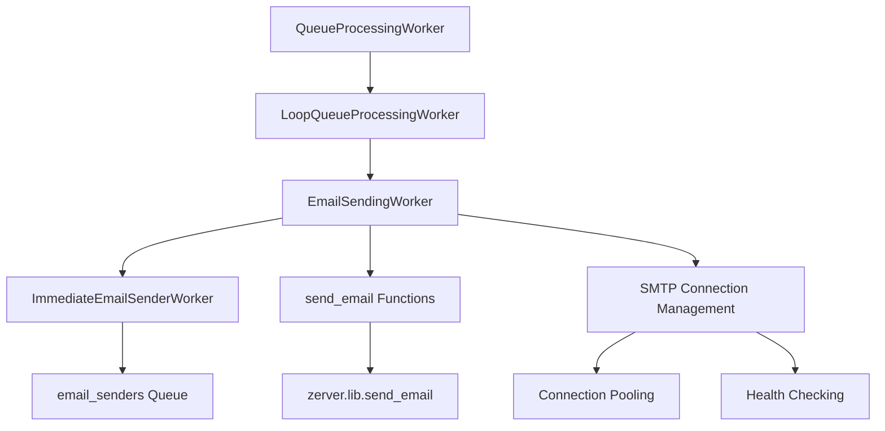
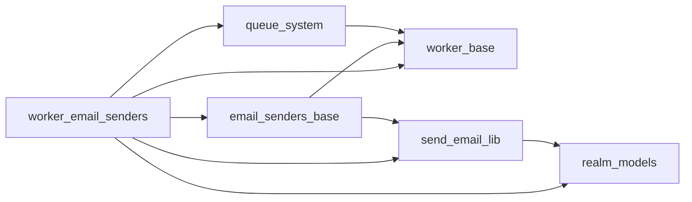
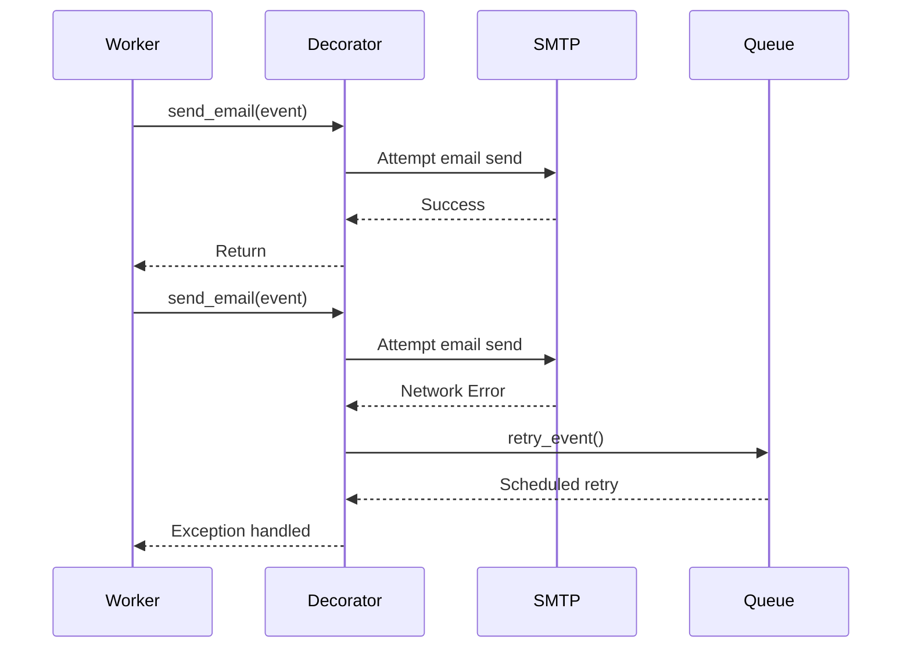
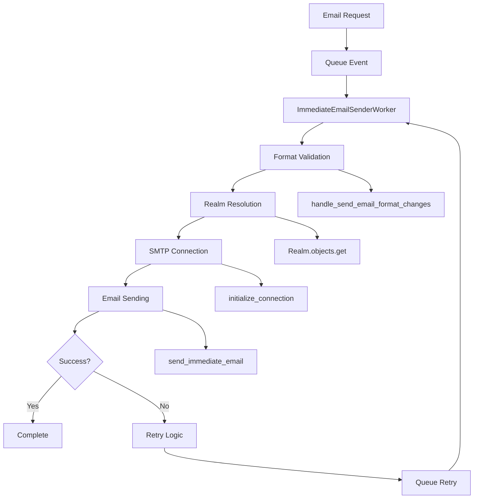

# Worker Email Senders Module

## Introduction

The `worker_email_senders` module is a critical component of Zulip's asynchronous email delivery system. It implements queue-based email processing workers that handle the reliable delivery of emails throughout the Zulip platform. This module ensures that email notifications, invitations, and other email communications are sent efficiently and reliably, with built-in retry mechanisms and error handling.

## Core Purpose

The primary purpose of this module is to:
- Process email sending requests from the `email_senders` queue
- Provide reliable email delivery with automatic retry mechanisms
- Handle various email types including notifications, invitations, and system emails
- Manage SMTP connection pooling and health checking
- Implement proper error handling and logging for email operations

## Architecture Overview

### Component Hierarchy

### Module Dependencies

## Core Components

### ImmediateEmailSenderWorker

The `ImmediateEmailSenderWorker` is the main worker class that processes email sending requests from the `email_senders` queue. It inherits from `EmailSendingWorker` and is specifically designed for immediate email delivery.

**Key Characteristics:**
- Queue assignment: `email_senders`
- Processing type: Immediate (real-time) email delivery
- Inherits all email sending capabilities from `EmailSendingWorker`
- Uses the `@assign_queue` decorator for automatic registration

### EmailSendingWorker

The `EmailSendingWorker` class provides the core email sending functionality, extending `LoopQueueProcessingWorker` with email-specific features.

**Key Features:**
- **Connection Management**: Maintains persistent SMTP connections with health checking
- **Retry Logic**: Implements automatic retry for transient failures (network issues, SMTP timeouts)
- **Batch Processing**: Processes multiple emails in batches for efficiency
- **Error Handling**: Comprehensive error handling with logging and failure tracking

**Core Methods:**
- `send_email()`: Main email sending method with retry decorator
- `consume_batch()`: Processes batches of email events from the queue
- `stop()`: Properly closes SMTP connections on worker shutdown

### Retry Mechanism

The module implements a sophisticated retry mechanism through the `retry_send_email_failures` decorator:

**Retry Conditions:**
- `socket.gaierror`: DNS resolution failures
- `TimeoutError`: Connection timeouts
- `EmailNotDeliveredError`: SMTP delivery failures

## Data Flow

### Email Processing Pipeline

### Event Processing Flow

1. **Event Reception**: Worker receives email event from `email_senders` queue
2. **Format Processing**: `handle_send_email_format_changes()` ensures backward compatibility
3. **Realm Resolution**: Converts `realm_id` to `Realm` object if present
4. **Connection Management**: `initialize_connection()` provides healthy SMTP connection
5. **Email Delivery**: `send_immediate_email()` performs actual email sending
6. **Error Handling**: Failures trigger retry mechanism or error logging

## Integration with Other Systems

### Queue System Integration

The module integrates with Zulip's queue processing system through:
- **Base Classes**: Inherits from `QueueProcessingWorker` and `LoopQueueProcessingWorker`
- **Queue Registration**: Uses `@assign_queue` decorator for automatic worker registration
- **Event Processing**: Implements `consume_batch()` for batch event processing
- **Statistics**: Provides worker statistics and monitoring capabilities

### Email Library Integration

Integration with [`zerver.lib.send_email`](send_email_lib.md) provides:
- **Email Building**: Template rendering and email construction
- **SMTP Management**: Connection pooling and health checking
- **Format Handling**: Email format validation and processing
- **Error Types**: Custom exception types for email-specific errors

### Realm Model Integration

Integration with [core models](core_models.md) enables:
- **Realm-specific Configuration**: Per-realm email settings
- **User Resolution**: Converting user IDs to email addresses
- **Contextual Information**: Realm-specific data in email templates

## Configuration and Settings

### Worker Configuration

- **Queue Name**: `email_senders`
- **Batch Size**: Configured in `LoopQueueProcessingWorker`
- **Prefetch Count**: 100 events (configurable via `PREFETCH`)
- **Timeout**: 30 seconds per event (configurable via `MAX_CONSUME_SECONDS`)

### Email Configuration

The module respects various Django email settings:
- `EMAIL_HOST`: SMTP server hostname
- `EMAIL_HOST_USER`: SMTP authentication username
- `EMAIL_HOST_PASSWORD`: SMTP authentication password
- `EMAIL_PORT`: SMTP server port
- `EMAIL_USE_TLS`: TLS encryption setting

## Error Handling and Monitoring

### Error Types

1. **Transient Errors**: Network issues, DNS failures, SMTP timeouts
2. **Permanent Errors**: Invalid email addresses, authentication failures
3. **System Errors**: Database connectivity, template rendering failures

### Monitoring and Logging

- **Statistics Files**: Worker performance metrics in `QUEUE_STATS_DIR`
- **Error Logging**: Failed events logged to `QUEUE_ERROR_DIR`
- **Sentry Integration**: Error tracking and performance monitoring
- **Connection Health**: SMTP connection status monitoring

### Recovery Mechanisms

- **Automatic Retry**: Exponential backoff for transient failures
- **Event Persistence**: Failed events preserved for manual inspection
- **Connection Reset**: Automatic SMTP connection recovery
- **Worker Restart**: Self-restart on critical failures

## Performance Considerations

### Batch Processing

- **Batch Size**: Configurable batch processing for efficiency
- **Memory Management**: Controlled prefetch limits
- **Connection Reuse**: Persistent SMTP connections reduce overhead

### Resource Management

- **Connection Pooling**: Reuses SMTP connections across emails
- **Timeout Handling**: Prevents worker hangs on slow operations
- **Memory Cleanup**: Proper cleanup of event data and connections

## Security Considerations

### Email Security

- **Address Sanitization**: Proper email address validation and formatting
- **Header Security**: Secure email header construction
- **Authentication**: SMTP authentication credential management

### Data Protection

- **Event Data**: Secure handling of email content and recipient information
- **Connection Security**: TLS encryption for SMTP connections
- **Error Sanitization**: Prevention of sensitive data in error logs

## Testing and Development

### Development Mode

- **Email Logging**: Development environment email capture
- **Dry Run Mode**: Test email generation without sending
- **Template Validation**: Email template syntax checking

### Testing Integration

- **Queue Mocking**: Test queue implementation for unit tests
- **Email Backend**: Specialized email backend for testing
- **Event Simulation**: Test event generation and processing

## Deployment and Operations

### Worker Management

- **Process Management**: Integration with Zulip's process management
- **Scaling**: Multiple worker processes for high-volume scenarios
- **Health Monitoring**: Worker health checks and restart policies

### Operational Metrics

- **Queue Depth**: Monitoring of email queue backlog
- **Processing Time**: Email sending performance metrics
- **Error Rates**: Failure rate monitoring and alerting
- **Connection Status**: SMTP connection health indicators

This module forms a critical part of Zulip's communication infrastructure, ensuring reliable and efficient email delivery across the platform while providing robust error handling and monitoring capabilities.