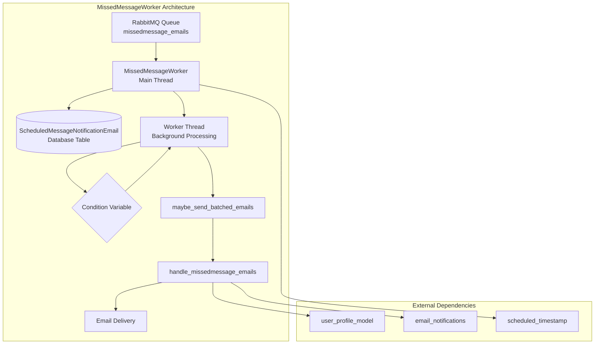
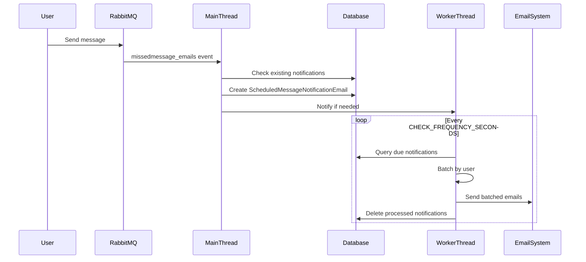
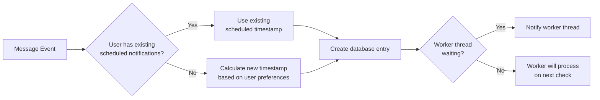
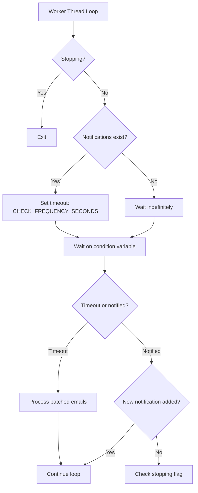
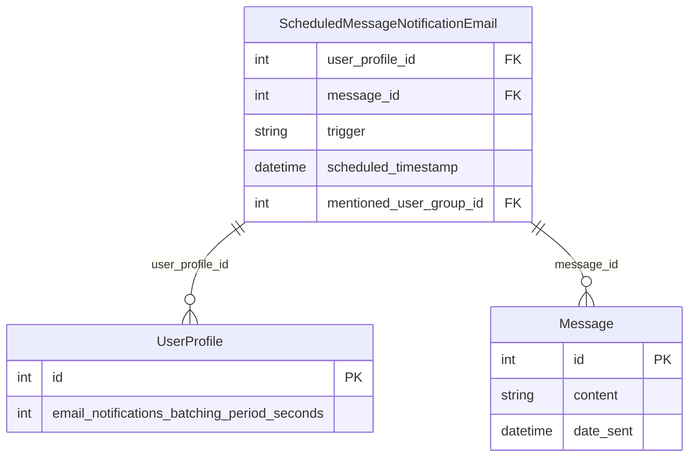
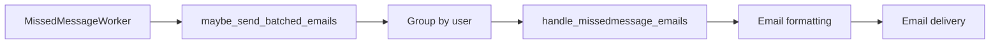
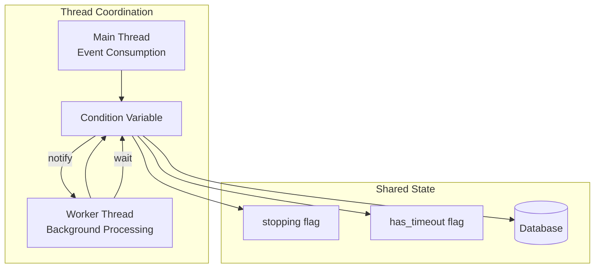

# Worker Missed Message Emails Module

## Introduction

The `worker_missedmessage_emails` module is a critical component of Zulip's notification system, responsible for processing and delivering email notifications for missed messages to users. This module implements a sophisticated batching mechanism that aggregates multiple missed messages over configurable time periods, reducing email spam while ensuring users receive timely notifications about important messages they may have missed.

## Architecture Overview

The module implements a multi-threaded queue processing system that balances real-time responsiveness with efficient batch processing. It uses Django's database models for persistence and implements sophisticated timing mechanisms to handle user-specific notification preferences.

## Core Components

### MissedMessageWorker

The `MissedMessageWorker` class is the central component that inherits from `QueueProcessingWorker` and implements sophisticated message batching logic. It operates using a dual-thread architecture:

- **Main Thread**: Handles RabbitMQ event consumption and database persistence
- **Worker Thread**: Manages background processing and email batching

#### Key Features:

1. **Configurable Batching Periods**: Each user can have custom email notification batching periods
2. **Thread-Safe Operations**: Uses condition variables for coordination between threads
3. **Error Resilience**: Implements exponential backoff for error recovery
4. **Database Transactions**: Uses atomic transactions to ensure data consistency

## Data Flow

### Event Processing Flow

### Background Processing Flow

## Database Schema Integration

The module integrates with the `ScheduledMessageNotificationEmail` model to persist notification scheduling information:

## Integration with Other Modules

### Dependencies

The module relies on several other Zulip subsystems:

1. **[core_models](core_models.md)**: Uses `UserProfile` and `Message` models for user and message data
2. **[core_libraries](core_libraries.md)**: Leverages `MissedMessageData` for structured message data
3. **[worker_queue_system](worker_queue_system.md)**: Inherits from `QueueProcessingWorker` base class
4. **[message_actions](message_actions.md)**: Integrates with message processing workflows

### Email Notification Processing

The module delegates actual email sending to the `handle_missedmessage_emails` function from the email notifications library:

## Configuration and Performance

### Timing Configuration

- **CHECK_FREQUENCY_SECONDS**: 5 seconds - How often the worker checks for due notifications
- **User-specific batching**: Configurable per user via `email_notifications_batching_period_seconds`

### Error Handling

The module implements sophisticated error handling:

1. **Database Integrity Errors**: Gracefully handles cases where messages are deleted before processing
2. **Exception Recovery**: Uses exponential backoff (max 30 seconds) for background loop failures
3. **User Isolation**: Failures for one user don't affect other users' notifications

### Threading Model

## Operational Considerations

### Staging Environment

In staging environments, the worker thread is disabled to prevent multiple worker instances from conflicting. The main thread waits indefinitely on the condition variable.

### Monitoring and Observability

The module includes comprehensive logging and Sentry integration:

- Debug logging for event processing
- Info logging for batch processing statistics
- Exception tracking with stack traces
- Sentry spans for performance monitoring

### Scalability

The module is designed for horizontal scaling within a single worker instance:

- Database-level locking prevents duplicate processing
- Batched operations reduce database queries
- User-level isolation prevents cascade failures
- Configurable check frequency balances responsiveness and resource usage

## Security Considerations

The module handles sensitive user data and implements appropriate security measures:

1. **User Data Access**: Uses `get_user_profile_by_id` for secure user lookups
2. **Database Transactions**: Uses `select_for_update()` to prevent race conditions
3. **Error Sanitization**: Logs contain user IDs but not message content
4. **Access Control**: Relies on upstream systems for message access validation

## Future Enhancements

Potential areas for improvement include:

1. **Dynamic Scaling**: Support for multiple worker instances
2. **Priority Queuing**: Handle high-priority notifications faster
3. **Batch Size Limits**: Prevent excessively large email batches
4. **Delivery Tracking**: Monitor email delivery success rates
5. **User Preferences**: More granular notification controls