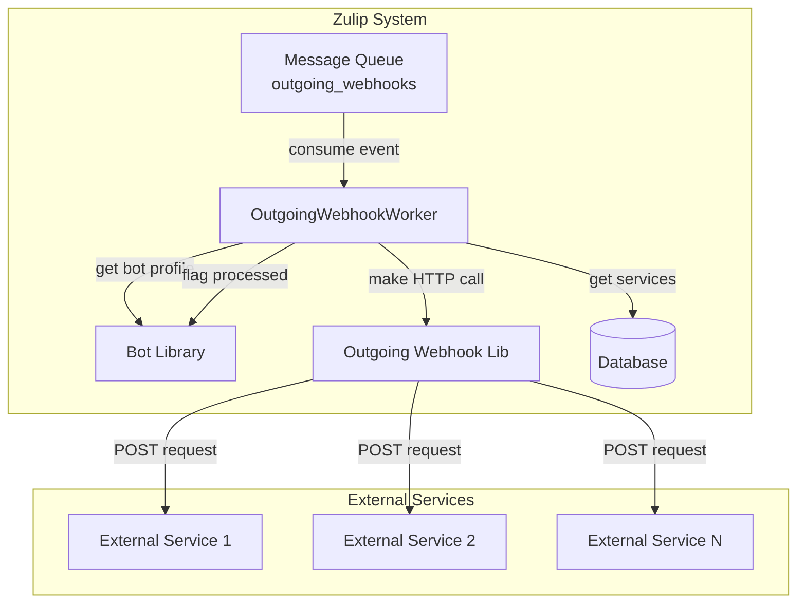
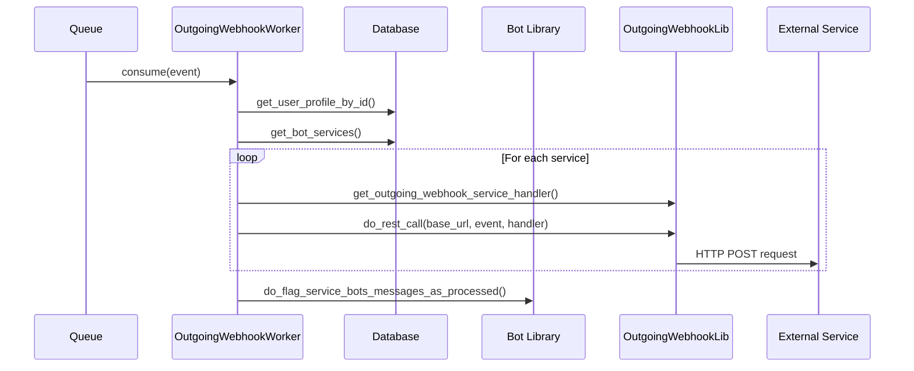

# Worker Outgoing Webhooks Module

## Introduction

The `worker_outgoing_webhooks` module is a specialized queue processing worker responsible for handling outgoing webhook integrations in Zulip. It processes webhook events from the `outgoing_webhooks` queue and makes HTTP requests to external services based on bot configurations. This module serves as a bridge between Zulip's internal messaging system and external webhook endpoints, enabling powerful integrations with third-party services.

## Architecture Overview

The module implements a queue-based architecture pattern where webhook events are processed asynchronously, ensuring reliable delivery to external services without blocking the main application flow.



## Core Components

### OutgoingWebhookWorker

The `OutgoingWebhookWorker` class is the main component that processes outgoing webhook events from the queue. It inherits from `QueueProcessingWorker` and is decorated with `@assign_queue("outgoing_webhooks")` to handle the specific queue.

**Key Responsibilities:**
- Consume webhook events from the `outgoing_webhooks` queue
- Retrieve bot configuration and associated services
- Execute HTTP requests to external webhook endpoints
- Mark messages as processed after successful webhook calls

**Process Flow:**


## Dependencies and Integration

### Internal Dependencies

The module relies on several key components from other Zulip modules:

1. **[worker_queue_system](worker_queue_system.md)**: Inherits from `QueueProcessingWorker` base class
2. **[core_libraries](core_libraries.md)**: Uses bot library functions for service management
3. **Outgoing Webhook Library**: Handles HTTP request logic and service handler management

### External Service Integration

The worker integrates with external services through:
- RESTful HTTP POST requests
- Configurable webhook endpoints per bot service
- Service-specific handlers for request formatting

## Data Flow

### Event Structure

Incoming events contain the following key data:
```json
{
    "message": {
        "id": "message_id",
        "content": "message content"
    },
    "user_profile_id": "bot_user_id"
}
```

### Processing Pipeline


## Configuration and Setup

### Queue Assignment

The worker is automatically assigned to the `outgoing_webhooks` queue through the `@assign_queue` decorator, ensuring it only processes relevant events.

### Bot Service Configuration

Bot services are configured through the database and retrieved using `get_bot_services()`, allowing dynamic configuration of webhook endpoints without worker restarts.

## Error Handling and Reliability

### Message Processing Guarantees

- Messages are flagged as processed only after all webhook calls complete
- Failed webhook calls are handled by the outgoing webhook library
- Queue-based processing ensures at-least-once delivery semantics

### Logging and Monitoring

The module includes comprehensive logging through Python's logging framework, with the logger named `zerver.worker.outgoing_webhooks` for easy identification and monitoring.

## Performance Considerations

### Scalability

- Asynchronous queue processing prevents blocking main application
- Multiple worker instances can process the queue in parallel
- Service lookups are optimized through database queries

### Resource Management

- HTTP connections are managed by the outgoing webhook library
- Database connections are handled through Django's ORM
- Memory usage is optimized by processing one event at a time

## Security Considerations

### Authentication

- Bot authentication is handled through user profile verification
- Service-specific authentication is managed by individual service handlers
- External webhook calls respect configured security settings

### Data Privacy

- Only necessary message data is sent to external services
- Bot permissions are verified before processing
- Sensitive information is filtered according to bot configuration

## Related Documentation

- [Worker Queue System](worker_queue_system.md) - Base queue processing infrastructure
- [Core Libraries](core_libraries.md) - Bot library and service management
- [Message Actions](message_actions.md) - Message processing and event generation
- [Event System](event_system.md) - Event types and handling mechanisms

## API Reference

### OutgoingWebhookWorker

```python
@assign_queue("outgoing_webhooks")
class OutgoingWebhookWorker(QueueProcessingWorker)
```

**Methods:**

- `consume(event: dict[str, Any]) -> None`: Process a webhook event from the queue

**Parameters:**
- `event`: Dictionary containing message data and bot user profile ID

**Returns:** None

**Raises:** Various exceptions handled by the queue processing system