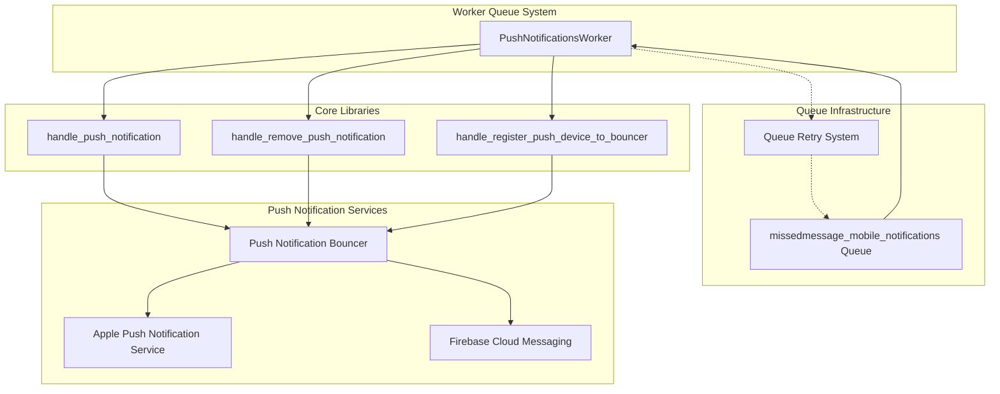
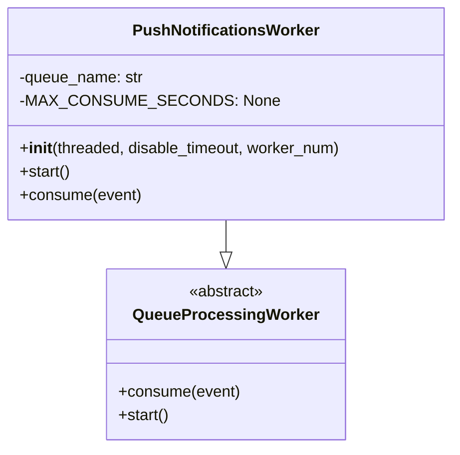
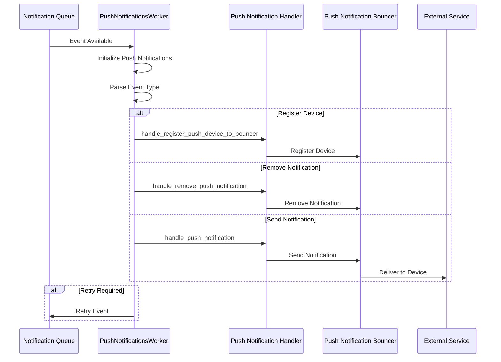
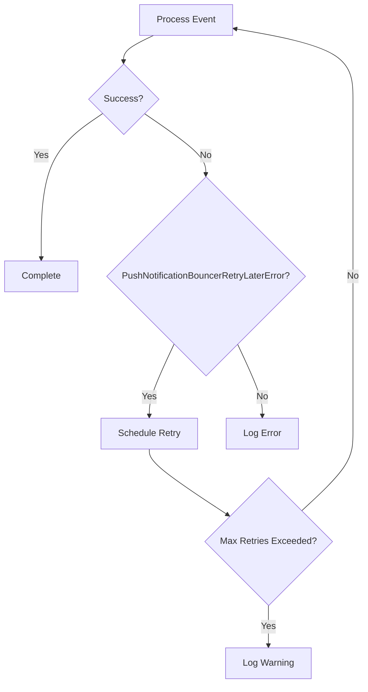

# Worker Push Notifications Module

## Introduction

The worker_push_notifications module is a specialized queue processing worker responsible for handling mobile push notifications in the Zulip messaging platform. It processes events from the `missedmessage_mobile_notifications` queue to deliver real-time notifications to mobile devices when users receive messages while offline or inactive.

This module serves as a critical component in Zulip's real-time notification system, ensuring that users stay informed of important messages even when they're not actively using the application.

## Architecture Overview

### Module Position in System

The worker_push_notifications module is part of the worker_queue_system module tree, specifically under the worker_push_notifications child module. It interfaces with multiple core systems:

- **Event System**: Receives notification events from the event queue
- **Push Notification Services**: Integrates with external push notification services (APNS, FCM)
- **User Management**: Accesses user profile information for targeting notifications
- **Message System**: Retrieves message content for notification formatting

### Core Architecture

## Core Components

### PushNotificationsWorker

The `PushNotificationsWorker` is the primary component responsible for processing push notification events. It extends the base `QueueProcessingWorker` class and implements specialized logic for handling different types of push notification events.

#### Key Features:

- **Queue Assignment**: Automatically assigned to the `missedmessage_mobile_notifications` queue
- **Sharding Support**: Supports horizontal scaling through queue sharding when `MOBILE_NOTIFICATIONS_SHARDS > 1`
- **Async Compatibility**: Disables SIGALRM-based timeouts due to asyncio usage in the push notification backend
- **Retry Logic**: Implements sophisticated retry mechanisms for failed push notification attempts

#### Component Structure:

## Data Flow

### Event Processing Flow

### Event Types

The worker processes three main types of events:

1. **register_push_device_to_bouncer**: Registers a mobile device for push notifications
2. **remove**: Removes/cancels push notifications for specific messages
3. **default**: Sends new push notifications for missed messages

## Dependencies and Integration

### Internal Dependencies

The module relies on several core Zulip components:

- **[core_libraries](core_libraries.md)**: Uses message and user data structures
- **[event_system](event_system.md)**: Processes notification events
- **[core_models](core_models.md)**: Accesses user profiles and message data

### External Dependencies

- **Push Notification Services**: Integrates with platform-specific services
  - Apple Push Notification Service (APNS) for iOS devices
  - Firebase Cloud Messaging (FCM) for Android devices
- **Push Notification Bouncer**: Zulip's intermediary service for managing push notifications

### Configuration Dependencies

- `settings.MOBILE_NOTIFICATIONS_SHARDS`: Controls queue sharding for scalability
- Push notification service credentials and configurations

## Error Handling and Resilience

### Retry Mechanism

The worker implements a sophisticated retry system for handling transient failures:

### Error Types

- **PushNotificationBouncerRetryLaterError**: Triggers automatic retry with exponential backoff
- **Other Exceptions**: Logged and skipped (no retry attempted)

## Scalability and Performance

### Queue Sharding

The module supports horizontal scaling through queue sharding:

- Multiple worker instances can process different queue shards
- Sharding is controlled by the `MOBILE_NOTIFICATIONS_SHARDS` setting
- Each worker is assigned a specific shard based on `worker_num`

### Performance Considerations

- **Async Processing**: Uses aioapns for non-blocking push notification delivery
- **No Timeout Constraints**: Disables SIGALRM to accommodate async operations
- **Efficient Event Processing**: Minimal overhead in event consumption

## Security Considerations

### Data Privacy

- User profile IDs are used for targeting but sensitive data is handled by the bouncer service
- Message content is processed through secure push notification channels
- Device registration tokens are managed securely

### Authentication

- Push notification services require proper authentication credentials
- Device registration is verified through the bouncer service
- No direct access to user credentials within the worker

## Monitoring and Observability

### Logging

The worker provides comprehensive logging for:
- Push notification processing status
- Retry attempts and failures
- Worker initialization and configuration

### Metrics

Key metrics to monitor:
- Queue processing rate
- Push notification delivery success rate
- Retry frequency and patterns
- Worker shard distribution

## Configuration

### Environment Variables

- `MOBILE_NOTIFICATIONS_SHARDS`: Number of queue shards (default: 1)
- Push notification service credentials (managed through Django settings)

### Worker Deployment

The worker can be deployed in multiple configurations:
- Single instance for small deployments
- Multiple sharded instances for high-throughput scenarios
- Can be integrated with process management systems (systemd, supervisord)

## Related Documentation

- [Worker Queue System](worker_queue_system.md) - Overview of the queue processing framework
- [Event System](event_system.md) - Event generation and routing
- [Core Libraries](core_libraries.md) - Data structures and utilities
- [Core Models](core_models.md) - User and message data models