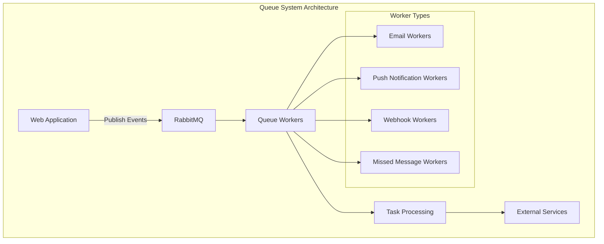
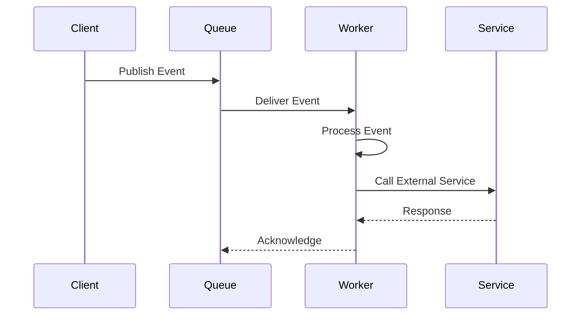

# Worker Queue System

## Introduction

The Worker Queue System is a critical component of the Zulip messaging platform that handles asynchronous task processing through a distributed queue-based architecture. This system enables reliable, scalable processing of background tasks such as email notifications, push notifications, and webhook integrations.

## Architecture Overview

The worker queue system implements a producer-consumer pattern where tasks are queued and processed asynchronously by specialized worker processes. The system is built on top of RabbitMQ for message queuing and provides robust error handling, monitoring, and retry mechanisms.

## Core Components

### Base Worker Framework

The foundation of the worker system is built around abstract base classes that provide common functionality:

- **QueueProcessingWorker**: Abstract base class for all queue workers
- **LoopQueueProcessingWorker**: Specialized worker for batch processing with configurable sleep delays

### Specialized Workers

The system includes several specialized worker implementations:

1. **[Email Workers](worker_email_senders.md)**: Handle immediate and batched email notifications
2. **[Missed Message Workers](worker_missedmessage_emails.md)**: Process missed message email notifications with intelligent batching
3. **[Push Notification Workers](worker_push_notifications.md)**: Manage mobile push notifications
4. **[Webhook Workers](worker_outgoing_webhooks.md)**: Handle outgoing webhook calls to external services

Each worker type is documented in detail in its respective sub-module documentation file.

## Key Features

### Reliability and Error Handling

- **Timeout Protection**: Workers have configurable timeouts to prevent hanging
- **Error Recovery**: Failed tasks are logged and can be retried
- **Health Monitoring**: Statistics tracking and health checks
- **Graceful Shutdown**: Proper cleanup and signal handling

### Performance Optimization

- **Batch Processing**: Support for processing multiple events in batches
- **Prefetch Control**: Configurable prefetch sizes for optimal performance
- **Memory Management**: Proper cleanup of database connections and caches
- **Statistics Collection**: Performance metrics and queue statistics

### Scalability

- **Multi-threading Support**: Workers can operate in threaded mode
- **Queue Sharding**: Support for queue sharding to distribute load
- **Worker Registration**: Dynamic worker registration system

## Data Flow

## Configuration

Workers are configured through Django settings with support for:

- Queue-specific settings
- Timeout configurations
- Batch sizes and processing delays
- Error handling policies
- Statistics collection intervals

## Integration Points

The worker queue system integrates with several other Zulip subsystems:

- **[Message System](core_models.md)**: Processes message-related events
- **[User Management](core_models.md)**: Handles user notification preferences
- **[Email System](authentication_and_backends.md)**: Sends email notifications
- **[Push Notification System](tornado_realtime.md)**: Manages mobile notifications

## Monitoring and Observability

The system provides comprehensive monitoring through:

- **Statistics Files**: JSON-based statistics written to disk
- **Sentry Integration**: Error tracking and performance monitoring
- **Logging**: Detailed logging of worker activities and errors
- **Health Checks**: Queue size monitoring and worker health status

## Error Handling

The worker system implements multiple layers of error handling:

1. **Exception Isolation**: Individual event failures don't affect other events
2. **Retry Logic**: Configurable retry mechanisms for transient failures
3. **Error Logging**: Failed events are logged for manual inspection
4. **Circuit Breakers**: Protection against cascading failures

## Deployment Considerations

- **Process Management**: Workers run as separate processes
- **Resource Usage**: Configurable resource limits and timeouts
- **Database Connections**: Proper connection management and cleanup
- **Signal Handling**: Graceful shutdown on SIGTERM/SIGINT

## Related Documentation

- [Core Models](core_models.md) - Data models used by workers
- [Message Actions](message_actions.md) - Message processing workflows
- [Event System](event_system.md) - Event handling and distribution
- [Tornado Realtime](tornado_realtime.md) - Real-time notification system